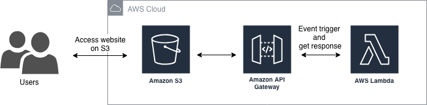
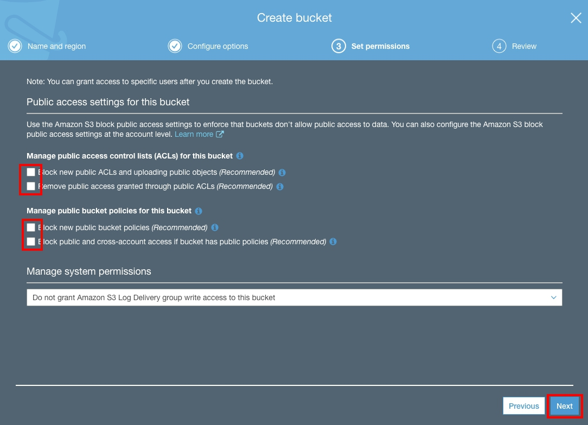
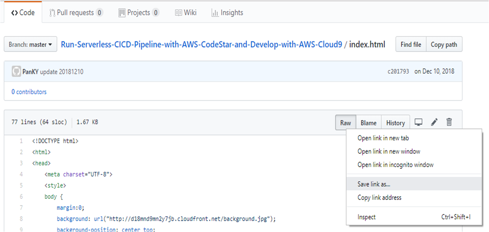
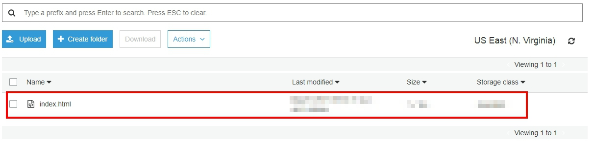
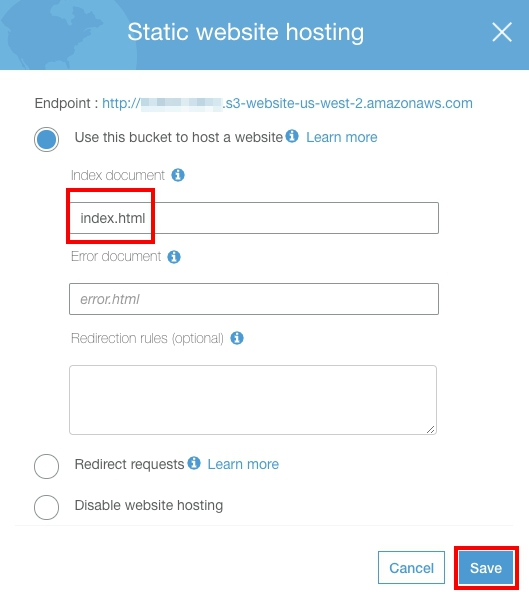
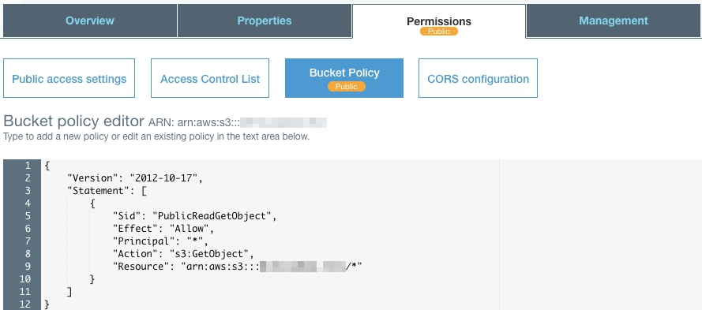

## Hosting a Static Website on Amazon S3

This section walks you create a static website on S3, and you can integrate the API endpoint with it in future.

You can host a static website on Amazon Simple Storage Service (Amazon S3). </br>
On a static website, individual webpages include static content. They might also contain client-side scripts. </br>
To host a static website, you configure an Amazon S3 bucket for website hosting, and then upload your website content to the bucket.

<p align="center">
    
</p>

### Create a S3 bucket

The web page need to be stored and performed with apache server. </br>
In this case, we'll create a S3 bucket for it and also enable public access that allow outcoming request.

- Open the [Amazon S3 console](https://console.aws.amazon.com/s3/home).
- Choose **Create Bucket**.
- For Bucket Name, type a **Unique DNS-compliant name** for your bucket.
- For Region, choose **US East(N.Virginia)**.
- Choose **Next** </br></br>
- On the **Configure options** page, leave it as default and choose **Next**.

  > You can configure the following properties and Amazon CloudWatch metrics for the bucket. Or, you can configure these properties and CloudWatch metrics later, after you create the bucket. </br>

- On the **Set permissions** page, you manage the permissions that are set on the bucket that you are creating.
- Under **Public access settings for this bucket**, cancel the default settings that are listed under **Manage public access control lists (ACLs) for this bucket** or **Manage public bucket policies for this bucket**.

> Because of this would lead you store web page on S3, the bucket should be open to world. </br>
> Otherwise, We highly recommend that you keep the default access settings for blocking public access to the bucket that you are creating.

<p align="center">
    
</p>

- Choose **Next**.
- On the **Review** page, verify the settings. And then choose **Create bucket**.

### Upload web page to S3 Bucket

We'll upload the web file to the S3 bucket just created via AWS CLI.

- Download web page from [Index.html](https://github.com/ecloudvalley/Run-Serverless-CICD-Pipeline-with-AWS-CodeStar-and-Develop-with-AWS-Cloud9/blob/master/index.html) file of current topic.
- Right click on the **Raw** button, and choose **Save link as**. Save it in any place of your computer.
> If you are using Mac, the file would be txt file, please remember to change the file name. ex: change index.html.txt to index.html
  <p align="left">
      
  </p>

- Back to S3 console, double click the S3 bucket you just created, and click **Upload** button.
- Drug _index.html_ you have downloaded to the upload page, and click **Next**.

- Back to the S3 console, and you will see the web page upload seccssfully.
  <p align="left">
      
  </p>

### Enable Static website hosting

Follow these steps to enable website hosting for your bucket.

- Select **Properties** tab.
- Click **Static website hosting**.
- Select **Use this bucket to host a website**.
- Type **index.html** for the index document, then click **Save**.

<p align="center">
    
</p>

- Verify the status of **Bucket hosting**.</br></br>

- Choose **Bucket Policy** tab in **Permissions** tab.

  > When you configure a bucket as a website, you must make the objects that you want to serve publicly readable.

- Copy below bucket policy, and paste it into the field. Make sure you have replaced **`<YOUR_BUCKET_NAME>`** with the bucket name then click **Save**.

```
{
    "Version": "2012-10-17",
    "Statement": [
        {
            "Sid": "PublicReadGetObject",
            "Effect": "Allow",
            "Principal": "*",
            "Action": [
                "s3:GetObject"
            ],
            "Resource": [
                "arn:aws:s3:::<YOUR_BUCKET_NAME>/*"
            ]
        }
    ]
}
```

<p align="center">
    
</p>

### Access website

- Choose **Static website hosting** in **Properties** tab.
- Click the **Endpoint** on the top of window.
  > The endpoint is like **_\<YOUR_BUCKET_NAME\>.s3-website-\<REGION\>.amazonaws.com_**.
- You will see the website as below:

<p align="center">
    
</p>

## Clean Up

To delete the AWS resources, perform the tasks below in order:

- Select the bucket for this tutorial in S3 console, then choose **Delete bucket**.
- In the **Delete bucket** dialog box, type the name of the bucket for confirmation, and then choose **Confirm**.

## Conclusion

Congratulations! You now have learned how to:

- Create a static website hosting through S3
