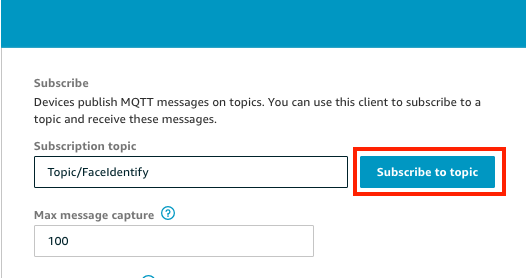
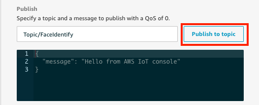
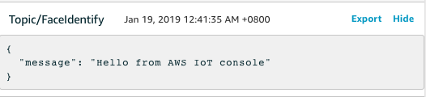
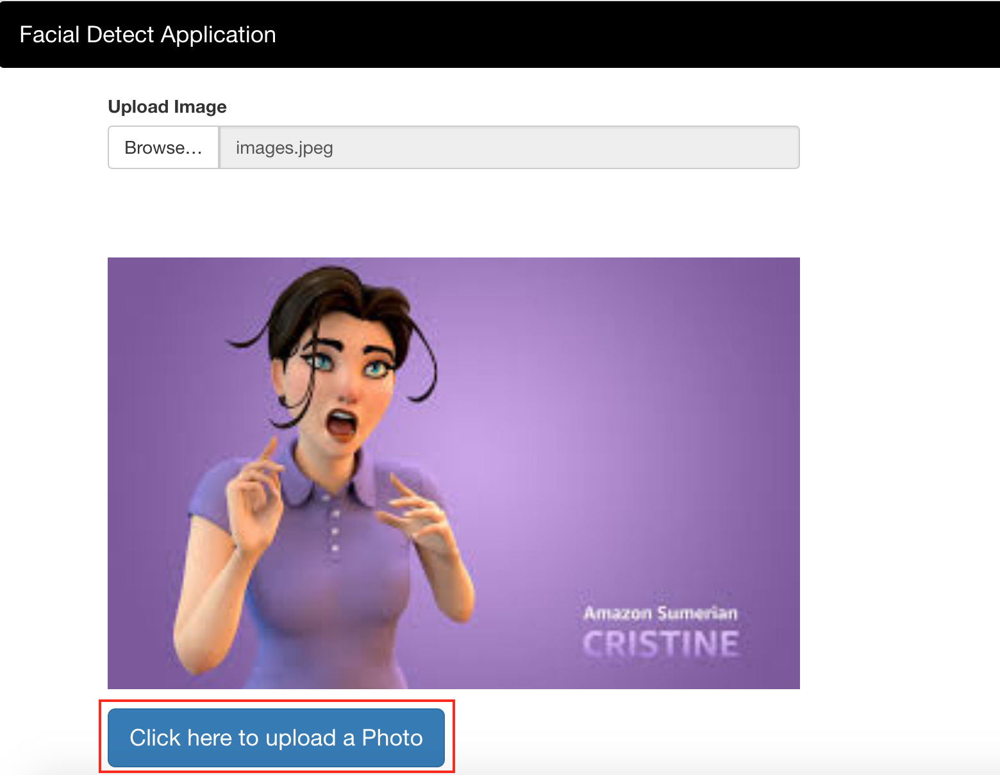
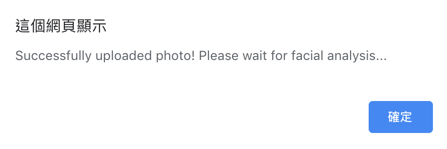
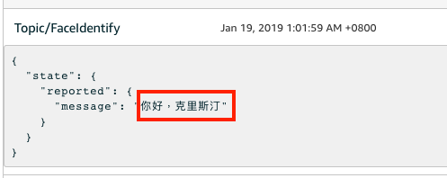
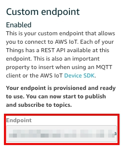

Publish Topic using MQTT
========================

MQTT is a machine-to-machine for Internet of Things connectivity protocol. It was designed as an extremely lightweight publish/subscribe messaging transport.
Here we will use MQTT publish a topic to AWS IoT. The topic message will contian face identify result. And in next lab we will subscribe this topic for get result.

 ## Prerequisites
  -  Make sure you are in __US East (N. Virginia)__, which short name is __us-east-1__.
  - Complete Lab : 
    1. [Create Customize Face Collection with Rekognition](../03-Integrating-Amazon-Rekognition-into-Applications/301-Create-Customize-Face-Collection-with-Rekognition.md)
    2. [Build a Serverless Facial Detect Application with AWS Lambda](../03-Integrating-Amazon-Rekognition-into-Applications/302-Build-a-Serverless-Facial-Detect-Application-with-AWS-Lambda.md)

## Lab tutorial
### Publish / Subscribe Topic using MQTT client
- On the __Service__ menu, click __IoT Core__, in the left navigation pane, choose __Test__.

- In the __Subscription topic__ field, type `Topic/FaceIdentify`, and then choose __Subscribe to topic__.
<center>

</center>

- Click __Publish to Topic__ to publish message - `Hello from AWS IoT console `.
<center>

</center>

- Below the Publish block, you will see the message already published.
<center>

</center>

### Modify Lambda function to Publish the face identify result 
- On the __Service__ menu, click __Lambda__, choose __face_identify__ function.

- Replace code by following, and we will publish result to `Topic/FaceIdentify`, enter your face collection name to replace `<your collection name>`:
```
import json
import boto3

rekognition_client = boto3.client('rekognition')
translate_client = boto3.client('translate')
iot_client = boto3.client('iot-data')

def lambda_handler(event, context):
    
    response = rekognition_client.search_faces_by_image(
        CollectionId='<your collection name>',
        Image={
            'S3Object': {
                'Bucket': event['Bucket'],
                'Name': event['ObjectName'],
            
            }
        },
        MaxFaces=2,
        FaceMatchThreshold=60
    )
    
    if len(response['FaceMatches']) == 0:
        print("No Matches!")
        rekognition_face = "This face is not in collection"
    else :
        rekognition_face = str(response['FaceMatches'][0]['Face']['ExternalImageId'])
        print("Rekognition result:"+rekognition_face)
        
        # set the message that sumerian speech
        message = "Hello, {0}"
        message = message.format(rekognition_face)
        
        # translate result into Simplified Chinese
        translate_response = translate_client.translate_text(
            Text=message,
            SourceLanguageCode='en',
            TargetLanguageCode='zh'
        )
        print("translate_response:",translate_response['TranslatedText'])
        
        # set up message
        IoTdata = {
                "state": {
                    "reported": {
                        "message": translate_response['TranslatedText']
                        }
                }
            } 
        
        # publish topic
        IoT_Response = iot_client.publish(
            topic='Topic/FaceIdentify',
            payload=json.dumps(IoTdata)
            )
    return (rekognition_face)
```

- Click __Save__.

### Upload image to Serverless Web 
Reupload [__test.jpeg__]('../03-Integrating-Amazon-Rekognition-into-Applications/test.jpeg') and use lambda to publish message with __IoT core__.

- Reload the web page and click the __Browse__ button to choose __test.jpeg__ in this repository.
<center>

</center>


- Click upload button to upload image to S3.
<center>

</center>


- If you success to upload, it will show the message.
<center>

</center>

- The result of identify face will show below the button.

<center>

</center>

- Back to __IoT__ page, you will see the new message had been publish.
<center>

</center>

- Choose __View endpoint__ at top right, and note your iot endpoint, this is also an important property to insert when using an MQTT client or the __AWS IoT Device SDK__.
<center>

</center>
<center>

</center>

## Conclusion
Congratulations! We now have learned how to:
- Publish topic using AWS IoT 
- Use Lambda to publish the topic

## Next Level:
- [Create a Virtual Assistant using Sumerian](../04-Building-Sumerian-Host-with-face-identify/402-Create-a-Virtual-Assistant-using-Sumerian.md)