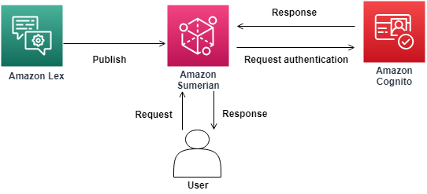
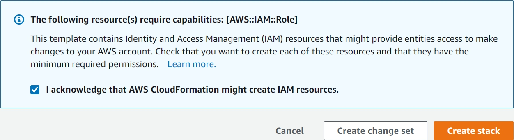
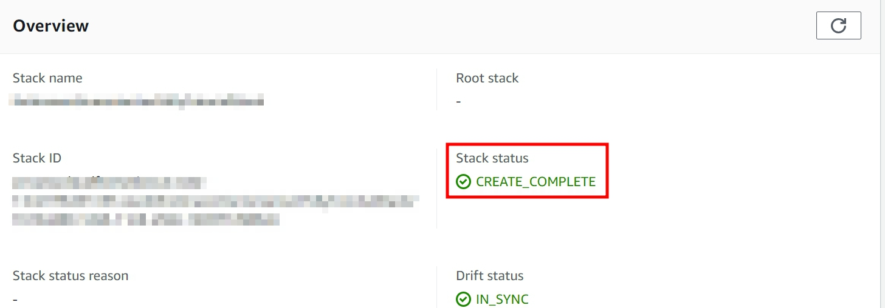
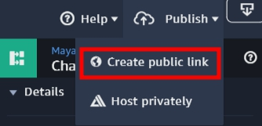
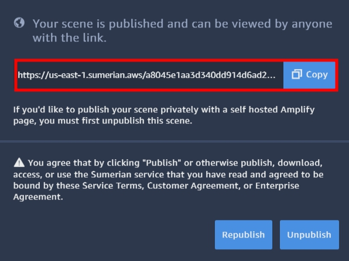

Using Amazon Lex to Build a Sumerian Chatbot
========================

Amazon Lex is a service for building conversational interfaces into any application using voice and text. As a fully managed service, you don’t need to worry about managing infrastructure. 

Amazon Sumerian lets you create and run virtual reality (VR), augmented reality (AR), and 3D applications quickly and easily without requiring any specialized programming or 3D graphics expertise.

## About this Lab
### Scenario

In this lab we will use an example Amazon Lex bot and connect it with a Sumerian host using the state machine and dialogue component.

 ## Prerequisites
  -  Make sure you are in __US East (N. Virginia)__, which short name is __us-east-1__.

## Lab tutorial
### Create an Amazon Cognito Identity Pool

Before we create the Sumerian scene, we need to set up an AWS CloudFormation stack.

- Create [AWS CloudFormation stack template](https://console.aws.amazon.com/cloudformation/home?region=us-east-1#/stacks/quickcreate?templateURL=https:%2F%2Fs3.amazonaws.com%2Fsumerian-cfn-templates%2FLexPollyExampleTemplate.yml&stackName=AmazonSumerianLexPollyTutorialStack) with this link.

> You may choose the "new AWS CloudFormation console" to complete this step.

- Check __I acknowledge that AWS CloudFormation might create IAM resources__, and __Create stack__.

- Be sure the __Stack status__ is __CREATE_COMPLETE__.

> NOTES : It will take a few minutes to create.

- Click __Outputs__ on panel, copy the __CognitoIdentityPoolID__, you will enter this value in Sumerian.

### Create an Amazon Lex Chatbot 
We use Amazon Lex template provided in this tutorial.
- On the __Service__ menu, click __Amazon Lex__, choose __Create__.

- Choose __BookTrip__ template, type __Bot name__ : `yourbotname`.

- __COPPA__ click __NO__, and __Create__.

- Choose the bot created before, click __Settings__, choose __Aliases__.

    __Alias name__ : `test`

    __Bot version__ : `Latest`

- Click __PLUS__ icon to add a new alias.

- Click __Publish__.
- __Choose an alias__ : `test `, and __Publish__.

> Waiting for publish, and you can close the page. 

### Create an Amazon Sumerian Scene 

- On the __Service__ menu, click __Amazon Sumerian__, you will get into the __Amazon Sumerian Dashboard__.

- Click __Create new scene__, and type your __Scene name__.

- Click the Entities of __yourscenename__ on the upper left corner, and then extend the __AWS Configuration__ on the right side.

- Insert your __CognitoIdentityPoolID__ into the __AWS configuration__ component.

- Click __Import Assets__, choose __Maya__ and select __Add__ to add a host.

- __Maya__ will show in the __Assets__ on your left side.

- Drop the __Maya__ in your scene, you will see __Maya__.

> Note : You may need to zoom in to see Maya.

### Adding the Dialogue Component
- Select __Maya__ entities, and click __Add component__, choose __Dialogue__.

- Insert the values for __Name__ and __Alias__, these inputs reference the Amazon Lex chatbot what you created.

### Creating a Chatbot Behavior Using the State Machine

- Select __Maya__ entities, and click __Add component__, choose __State Machine__.

- Open the __State Machine__, click __PLUS__ button to add a new behavior.

- Rename the __name__ : `ChatBot`.

- Rename __State 1__ : `Start`, and choose __Add Action__.

- Search for and __add__ `AWS SDK Ready`.

- Click __Add State__ for __five__ times to create five states.

> It will be like this.

-  Choose the new state, and __rename__ it.

    __State 1__ : `Wait for Input`

    __State 2__ : `Start Recording`

    __State 3__ : `Stop Recording`

    __State 4__ : `Process with Lex`

    __State 5__ : `Play Response`

- Click state __Wait for Input__, add a __Key Down__ action.

- Change the key : __T__

- Click state __Start Recording__, add  __Start Microphone Recording__ and __Key Up__ action.

- Click state __Stop Recording__, add a __Stop Microphone Recording__ action.

- Click state __Process with Lex__, add a __Send Audio Input to Dialogue Bot__ action.

> Do not select Log user input or Log bot response.

- Click state __Play Response__, add a __Start Speech__ action and select __Use Lex Response__.

- Adding transitions by __clicking__ the state and __dragging__ the arrow to another state

> On the Process With Lex state, drag the transition from the "On Response Ready output".

> The final graph will look like the following.

### Publish Sumerian Chatbot

- Click __Publish__, select __Create publish link__, and then __Publish__.

- __Copy__ the link.

- __Paste the link__ on your browser, you can press __T__ to talk with her.

> You can say "Book a hotel" or "Book a car" to start the dialogue.

## Conclusion
Congratulations! We now have learned how to:
- Create an Amazon Cognito Identity Pool
- Create an Amazon Lex chatbot
- Create an Amazon Sumerian Scene

## Next Level:
- [Using-Amplify-Deploy-Sumerian-with-React](../05-Using-Amplify-deploy-Sumerian/502-Using-Amplify-Deploy-Sumerian-with-React.md)