Using AWS Amplify to Deploy a Sumerian Chatbot with React Component
========================

AWS Amplify makes it easy to create, configure, and implement scalable mobile and web apps powered by AWS. Amplify seamlessly provisions and manages your mobile backend and provides a simple framework to easily integrate your backend with your iOS, Android, Web, and React Native frontends. Amplify also automates the application release process of both your frontend and backend allowing you to deliver features faster.

 ## Prerequisites
  -  Make sure you are in __US East (N. Virginia)__, which short name is __us-east-1__. 

  - Complete Lab : 
    - [Using Amazon Lex to Build an Amazon Sumerian Chatbot](../05-Using-Amplify-depoly-Sumerian/501-Using-Lex-Build-Sumerian-Chatbot.md)

  - Recommend to use [Visual Studio Code](https://code.visualstudio.com/) for this tutorial.


### Scenario

AWS Amplify recently added an XR category that has built-in support for Amazon Sumerian.

In this lab, you will learn how to set up an AWS Amplify React app to hold a Sumerian Chatbot scene for both authenticated and unauthenticated users to access.

<center>
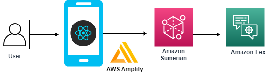
</center>


## Lab tutorial
### Install AWS Amplify CLI

__Open Visual Studio Code's terminal__, Using command line to install AWS Amplify CLI.

- Install [Node.js](https://nodejs.org/en/download/) and [npm](https://www.npmjs.com/get-npm) if they are not already on your machine.

> You need to restart computer to ensure the VScode can run Node.js and npm.

- Type `node -v` and `npm -v` in a VScode terminal window to verify Node.js and npm version.

    - Node.js : 8.x.x (at least).

    - npm : 5.x.x  (at least).


<center>

</center>

- Use `npm install -g @aws-amplify/cli` to install __Amplify CLI__.

> NOTES : It will take a few minutes to install the Amplify CLI.

- Type `amplify configure` to configure Amplify CLI.


> If you want to use __existing IAM User__, please press "enter" to ignore the first two question, and then paste your __accessKeyId & secretAccessKey__.

<center>

</center>


<center>

</center>


### Create a React App with Amplify 

Using command line to create react app. 

- Create react app by using __create-react-app__, `npx create-react-app sumerian-amplify-app`.

> The file will default create in __C:\Users\USER\sumerian-amplify-app__.

- Change to react project with `cd sumerian-amplify-app`.


- Install the __aws-amplify__ and __aws-amplify-react__ libraries with `npm install aws-amplify aws-amplify-react --save`.

<center>

</center>

### Initialize a new AWS Amplify project


- Initialize the cloud resources for our app, type `amplify init` in terminal.

> It will prompt you with a few questions.

<center>

</center>


- Select __NO__ when ask __"Do you want to use an AWS profile"__.

- Paste your AWS account __accessKeyId__ and __secretAccessKey__.

<center>

</center>

- Select the __region__ where your __Sumerian scene__ published.

<center>

</center>

> It take a few minutes to initialize and connect to the cloud.

<center>

</center>

- Use `amplify push` to provision the initial cloud resources for our app.

<center>

</center>


### Add Config in AWS Amplify Project

- Open __sumerian-amplify-app__ project with [Visual Studio Code](https://code.visualstudio.com/)

- Extend the __src__ folder, select __App.js__.

<center>
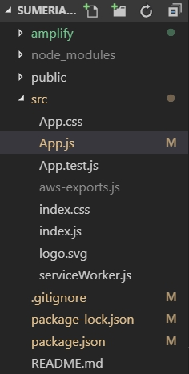
</center>


- Update the __App.js__.
    
    Replace `your_scene_region` in line 13.
    > For eaxample : us-east-1

    Replace `your_scene_name` in line 15, 28.
```
import React, { Component } from 'react';
import './App.css';
import aws_exports from './aws-exports';
import Amplify, { XR } from 'aws-amplify';
import scene_config from './sumerian-exports';
import { withAuthenticator, SumerianScene  } from 'aws-amplify-react';
import AWS from 'aws-sdk';
new AWS.Polly();


 XR.configure({ // XR category configuration
   SumerianProvider: { // Sumerian-specific configuration
     region: '<your_scene_region>', // Sumerian scene region
     scenes: {
       "<your_scene_name>": {   // Friendly scene name
           sceneConfig: scene_config // Scene JSON configuration
         },
     }
   }
 });

 Amplify.configure(aws_exports);

 class App extends Component {
    render() {
      return (
        <body> {}
          <SumerianScene sceneName='<your_scene_name>'/>
        </body>
      );
    }
  }

 export default withAuthenticator(App, { includeGreetings: true });
```

- Update the fowlling content in __Index.css__.

```
body {
  margin: 0;
  padding: 0;
  font-family: -apple-system, BlinkMacSystemFont, "Segoe UI", "Roboto", "Oxygen",
    "Ubuntu", "Cantarell", "Fira Sans", "Droid Sans", "Helvetica Neue",
    sans-serif;
  -webkit-font-smoothing: antialiased;
  -moz-osx-font-smoothing: grayscale;
  height: 600px;
}

code {
  font-family: source-code-pro, Menlo, Monaco, Consolas, "Courier New",
    monospace;
}


```

> Don't forget to save the changes.

### Add an Authentication Service to the Amplify Project

- Get into your __sumerian-amplify-app__ folder in terminal.

- Type `amplify add auth` in terminal, select __Yes__ to use the default configuration.

<center>

</center>


- Type `amplify push` to update CloudFormation stack.

> NOTES : It will take a few minuites to update the stack.

<center>

</center>


- Extend the __amplify / backend__ folder, open the __amplify-meta.json__.

<center>
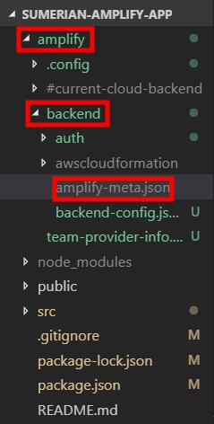
</center>

- Note the __UnauthRoleName__ and __AuthRoleName__ and __IdentityPoolName__, we will use it later.


<center>
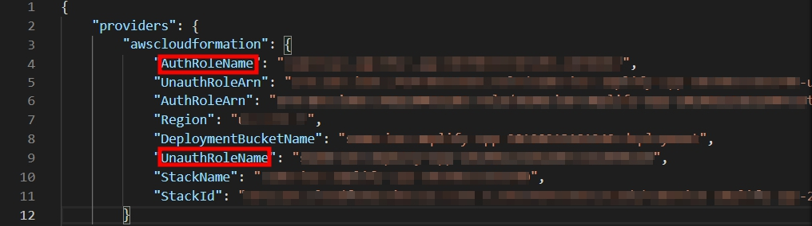
</center>


<center>
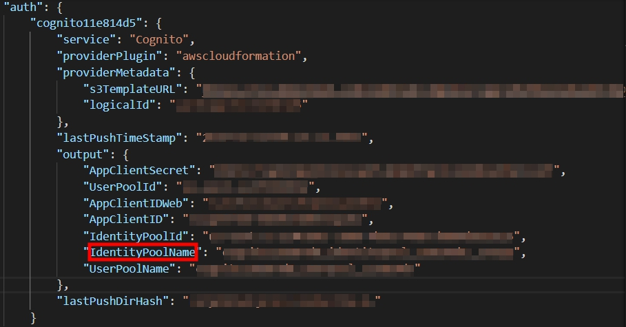
</center>


- Back to AWS console click __Services__, select __IAM__.

- Choose __Roles__, search your __UnAuthRoleName__ and click in.

- Select __Add inline policy__.

<center>

</center>

- Select __JSON__, and paste the fowlling content.
```
{
     "Version": "2012-10-17",
     "Statement": [
         {
             "Effect": "Allow",
             "Action": [
                 "sumerian:ViewRelease"
             ],
             "Resource": "*"
         }
     ]
 }
```

<center>

</center>

- Click __Review policy__.

- Tpye a __Name__ for policy, and then __Create policy__.

> This policy will allow your app to load the Amazon Sumerian scene.

- Click __Add inline policy__ again.

- Select __JSON__, and paste the following content.

```
{
    "Version": "2012-10-17",
    "Statement": [
        {
            "Effect": "Allow",
            "Action": [
                "cloudwatch:GetMetricStatistics",
                "cloudwatch:DescribeAlarms",
                "cloudwatch:DescribeAlarmsForMetric",
                "kms:DescribeKey",
                "kms:ListAliases",
                "lambda:GetPolicy",
                "lambda:ListFunctions",
                "lex:*",
                "polly:DescribeVoices",
                "polly:SynthesizeSpeech"
            ],
            "Resource": [
                "*"
            ]
        },
        {
            "Effect": "Allow",
            "Action": [
                "lambda:AddPermission",
                "lambda:RemovePermission"
            ],
            "Resource": "arn:aws:lambda:*:*:function:AmazonLex*",
            "Condition": {
                "StringLike": {
                    "lambda:Principal": "lex.amazonaws.com"
                }
            }
        },
        {
            "Effect": "Allow",
            "Action": [
                "iam:GetRole",
                "iam:DeleteRole"
            ],
            "Resource": [
                "arn:aws:iam::*:role/aws-service-role/lex.amazonaws.com/AWSServiceRoleForLexBots",
                "arn:aws:iam::*:role/aws-service-role/channels.lex.amazonaws.com/AWSServiceRoleForLexChannels"
            ]
        },
        {
            "Effect": "Allow",
            "Action": [
                "iam:CreateServiceLinkedRole"
            ],
            "Resource": [
                "arn:aws:iam::*:role/aws-service-role/lex.amazonaws.com/AWSServiceRoleForLexBots"
            ],
            "Condition": {
                "StringLike": {
                    "iam:AWSServiceName": "lex.amazonaws.com"
                }
            }
        },
        {
            "Effect": "Allow",
            "Action": [
                "iam:DeleteServiceLinkedRole",
                "iam:GetServiceLinkedRoleDeletionStatus"
            ],
            "Resource": [
                "arn:aws:iam::*:role/aws-service-role/lex.amazonaws.com/AWSServiceRoleForLexBots"
            ]
        },
        {
            "Effect": "Allow",
            "Action": [
                "iam:DetachRolePolicy"
            ],
            "Resource": [
                "arn:aws:iam::*:role/aws-service-role/lex.amazonaws.com/AWSServiceRoleForLexBots"
            ],
            "Condition": {
                "StringLike": {
                    "iam:PolicyArn": "arn:aws:iam::aws:policy/aws-service-role/AmazonLexBotPolicy"
                }
            }
        },
        {
            "Effect": "Allow",
            "Action": [
                "iam:CreateServiceLinkedRole"
            ],
            "Resource": [
                "arn:aws:iam::*:role/aws-service-role/channels.lex.amazonaws.com/AWSServiceRoleForLexChannels"
            ],
            "Condition": {
                "StringLike": {
                    "iam:AWSServiceName": "channels.lex.amazonaws.com"
                }
            }
        },
        {
            "Effect": "Allow",
            "Action": [
                "iam:DeleteServiceLinkedRole",
                "iam:GetServiceLinkedRoleDeletionStatus"
            ],
            "Resource": [
                "arn:aws:iam::*:role/aws-service-role/channels.lex.amazonaws.com/AWSServiceRoleForLexChannels"
            ]
        },
        {
            "Effect": "Allow",
            "Action": [
                "iam:DetachRolePolicy"
            ],
            "Resource": [
                "arn:aws:iam::*:role/aws-service-role/channels.lex.amazonaws.com/AWSServiceRoleForLexChannels"
            ],
            "Condition": {
                "StringLike": {
                    "iam:PolicyArn": "arn:aws:iam::aws:policy/aws-service-role/LexChannelPolicy"
                }
            }
        }
    ]
}
```
- Click __Review policy__.

- Tpye a __Name__ for policy, and then __Create policy__.

> This policy will allow your Sumerian scene to use Amazon Lex.

<center>

</center>

> It will look like the following.

- Attach __two same Inline policies__ to __AuthRolename with the same steps as UnauthRolename__.

- Click __Services__, select __Cognito__.  

- Select __Manage Identity Pools__.

- Search for your __IdentityPoolName__ and click in.

- Click __Edit identity pool__ on  the upper right corner.

- Extend the __Unauthenticated identities__, check the __Enable access to unauthenticated identities__ option.


<center>
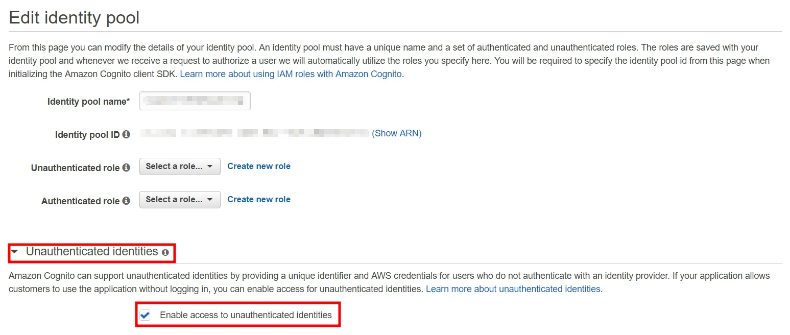
</center>


- Copy the __Identity pool ID__, we will use it later.


<center>
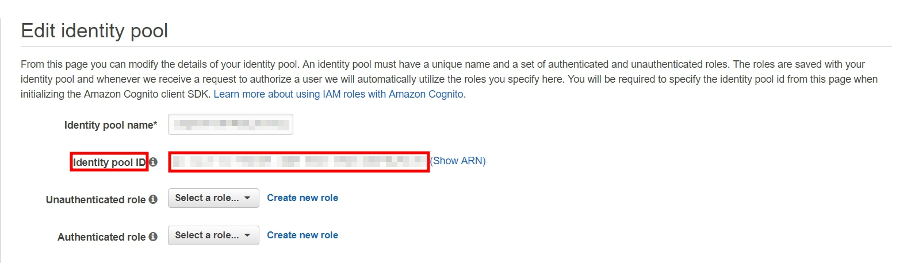
</center>


- Click __Services__, select __Amazon Sumerian__.

- Choose the __Scene__ you created before, and __Open in the Editor__.


<center>
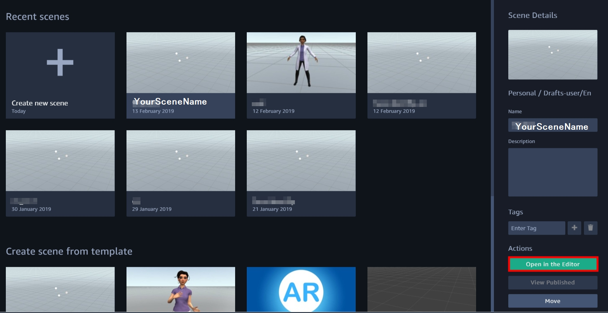
</center>

- Click the Entities of __yourscenename__ on the upper left corner.


<center>

</center>

- Extend the __AWS Configuration__, update the __Cognito Identity Pool ID__.


<center>

</center>

### Publish Amazon Sumerian Scene Privately 

- Click __Scene__ on the upper left corner, and select __Save__.


<center>
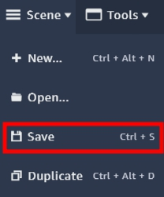
</center>

- Click __Publish__ on upper right corner, and choose __Host privately__.

> If you are already published, click unpublish.

<center>
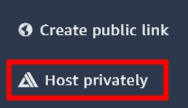
</center>

- Click __Publish__.

<center>
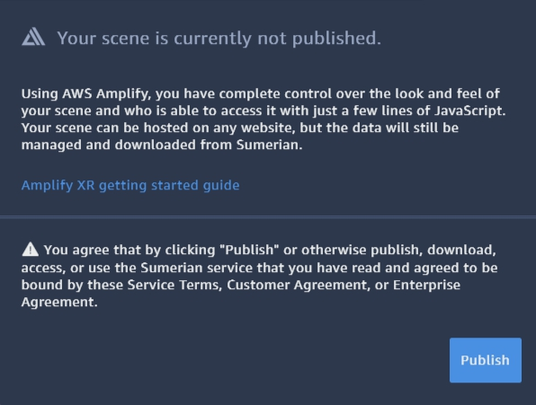
</center>

- You will see a JSON file, __Download JSON configuration__.

<center>
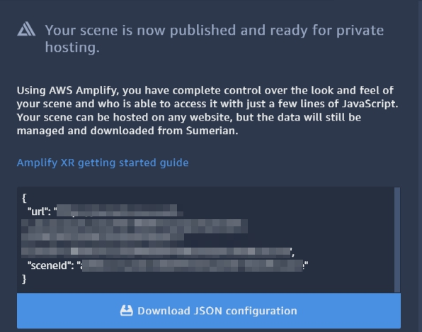
</center>

- Drag the JSON file in __src__ folder and rename it to `sumerian-exports.js`.


<center>
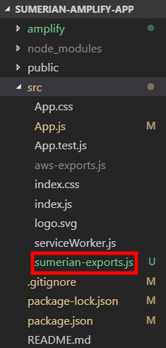
</center>

- Update the content of __sumerian-export.js__ as following.

<center>
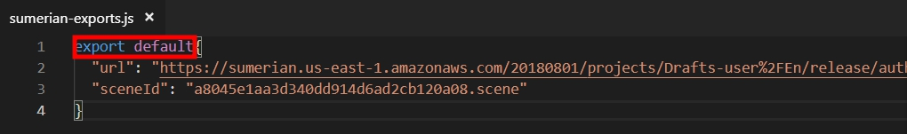
</center>


### Run the React App

- Type `npm start` to run your app in local.

<center>

</center>

> It will run on your browser.

- Select __Create account__.

<center>

</center>

- Insert your information, and select __CREAT ACCOUNT__. 

<center>

</center>

- Get your phone to receive the __verification code__, and select __Confirm__.

<center>

</center>

- Log in again, you will see the Sumerian scene.


<center>

</center>


<center>

</center>


- Press __T__ to talk with her.

> You can say "Book a hotel" or "Book a car" to start the dialogue.

> You can press "Ctrl+c" in terminal to end this work.

### Running on a VR or AR Device

- Type `amplify add hosting` to set up.

- Choose __DEV__ to create a S3 hosting bucket.

<center>

</center>

- Insert your __hosting bucket name__, and choose the following option.


<center>

</center>

- Type `amplify publish` to publish your Amplify project.

- This publishes the app to a live URL, you can open the URL in any browser or VR headset.

<center>

</center>

## Conclusion
Congratulations! We now have learned how to:
- Install AWS Amplify CLI.
- Create a React app.
- Publish Sumerian scene privately.
- Use AWS Amplify to deploy an app.

## Clean Up

- S3 hosting bucket
- The Sumerian Scene
- Cognito identity pool
- Amazon Lex chatbot
