# Implement an LAMP structure

## Overview

**LAMP** is an archetypal model of web service stacks, named as an acronym of the names of its original four open-source components: **the Linux operating system, the Apache HTTP Server, the MySQL relational database management system (RDBMS), and the PHP programming language**.

**Amazon RDS** makes it easy to set up, operate, and scale a relational database in the cloud. It provides cost-efficient and resizable capacity while automating time-consuming administration tasks such as hardware provisioning, database setup, patching and backups. It frees you to focus on your applications so you can give them the fast performance, high availability, security and compatibility they need.

**Amazon RDS** is available on several database instance types - optimized for memory, performance or I/O - and provides you with six familiar database engines to choose from, including Amazon Aurora, PostgreSQL, MySQL, MariaDB, Oracle Database, and SQL Server. You can use the AWS Database Migration Service to easily migrate or replicate your existing databases to Amazon RDS.

## Scenario

In this lab, we will prepare our **VPC** through **Cloudformation**. Create a **RDS** instance, and then launch an **EC2 instance** with user data.

## Prerequisites

* Make sure your region is in: **N. Virginia**.

* Download the source file of this lab:
    * [VPC.yaml](VPC.yaml)

## Step by step

### Set up your VPC with CloudFormation template

Use the [ClouFormation template](VPC.yaml) to setup your environment.

1. On the **Service** menu, select [CloudFormation](https://console.aws.amazon.com/cloudformation/).

2. Select **Create Stack**.

3. ☑ **Template is ready**.

4. In **Specify template**, ☑ **Upload a template file**.

5. Select **Choose file**, and select **VPC.yaml** and click **Next**.

<div>
<p align=center>
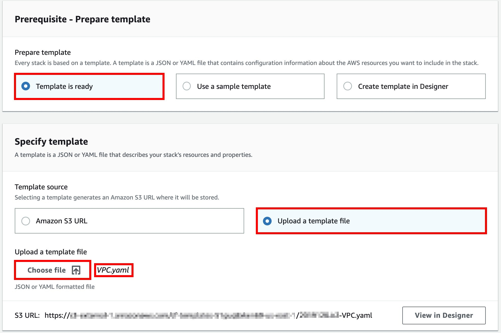
</p>
</div>

6. Input `Lab-Stack-<your-name>` for the **Stack name**, select **Next**.
> Ex: `Lab-Stack-John`.

7. Leave the settings as default, select **Next**.

8. Review the details of this stack, if there is no problem select **Create stack**.

### Create a Security Group for RDS database

For the security layer, we have to limit the source which can access to our database.

1. On the **Service** menu, select [EC2](https://console.aws.amazon.com/ec2/v2/home?region=us-east-1)

2. On the left navigation pane, select **Security Groups**.

3. Select **Create Security Group**.

4. Fill in these configurations:
    * **Security group name**: `Lab DB Security Group`
    * **Description**: `Allow Web instance only`
    * **VPC**: `Lab VPC`

5. Select the **Inbound** tab, click **Add Rule**.

6. Add a **MySQL/Aurora** inbound rule:
    * Type: `MySQL/Aurora`
    * Source: `<Your-Web-Security-Grpup-ID>`
    > The **Web Security Group** is created by the **CloudFormation template**, it should be named: `WebSecurityGroup`

<div>
<p align=center>
<image src="images/Database_SG.jpg" width=70% height=70%>
</p>
</div>

### Create RDS DB subnet group

1. On the **Service** menu, select **RDS**.

2. On the left navigation pane, select **Subnet groups**.

3. Select **Create DB Subnet Group**.

4. Fill in these configurations:
    * Name: `Lab DB subnet group`
    * Description: `Lab DB subnet group`
    * VPC: `Lab VPC`

5. Add both **Private subnets**:
    1. * Availiablity zone: `us-east-1a`
       * Subnet: Select the one with `10.0.1.0/24` and click **Add subnet**.

    2. * Availiablity zone: `us-east-1b`
       * Subnet: Select the one with `10.0.2.0/24` and click **Add subnet**.

<div>
<p align=center>
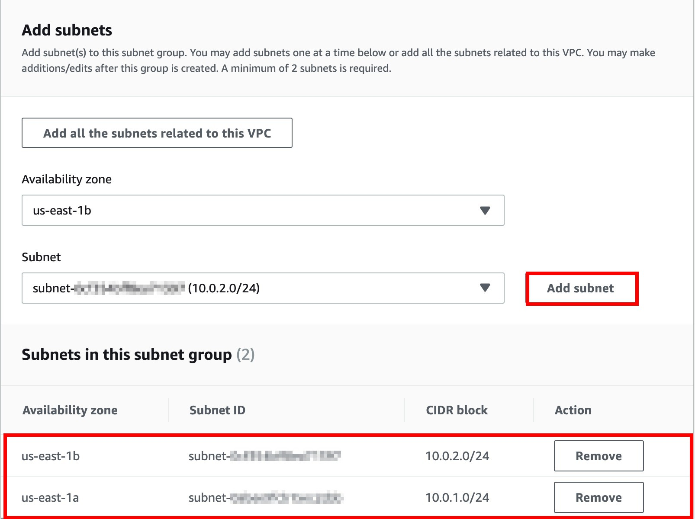
</p>
</div>

6. Select **Create**.

### Create a RDS Instance

1. On the **Service** menu, select **RDS**.

2. On the left navigation pane, select **Databases**.

3. Select **Create database**.

4. Select **MySQL** for **Engine options**.

<div>
<p align=center>
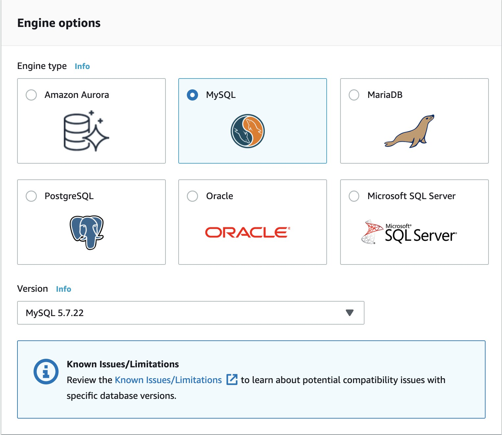
</p>
</div>

5. Select **Production - MySQL** for **Use Case**, and select **Next**.

<div>
<p align=center>
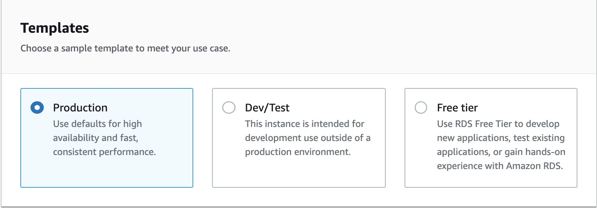
</p>
</div>

6. For the **Settings** section:

    * **DB instance identifier**: `lab`
    
    * Expand **Credentials Settings**:
        * **Master username**: `master`
        
        * Uncheck **Auto generate a password**

        * **Master password**: `lab-password`

        * **Confirm password**: `lab-password`
<div>
<p align=center>
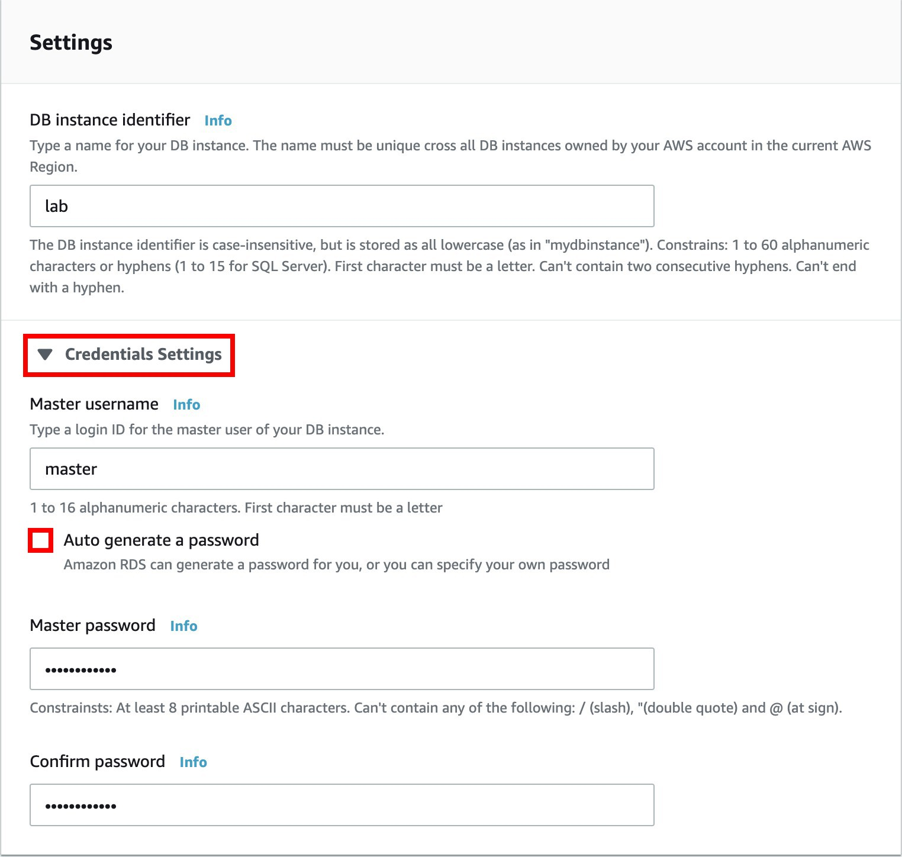
</p>
</div>

7. For the **DB instance size** section:
    * **DB instance performance type**: ☑ **Burstable**
    * **DB instance class**: `db.t2.micro`

<div>
<p align=center>
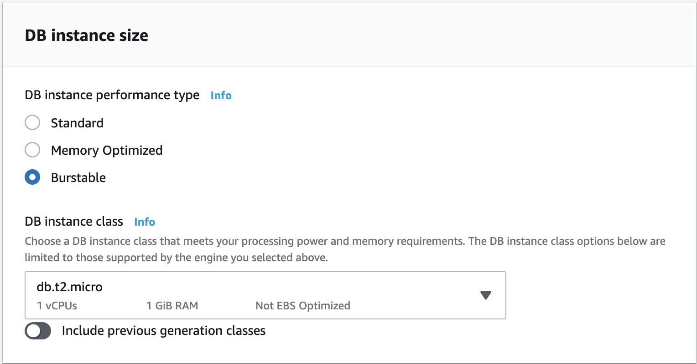
</p>
</div>

8. For the **Storage** section:
    * **Storage type**: `General Purpose (SSD)`
    * **Allocated storage**: `20` **GiB**

<div>
<p align=center>
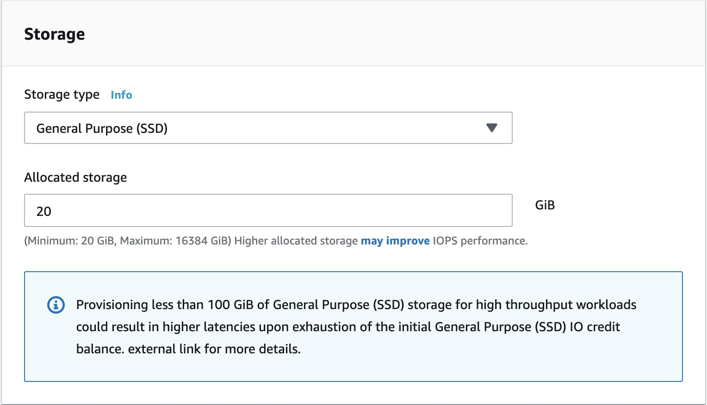
</p>
</div>

9. (Optional) ☑ **Do not create a standby instance**
> For this Lab we only need one RDS instance, so we don't have to create a standby instance.

<div>
<p align=center>
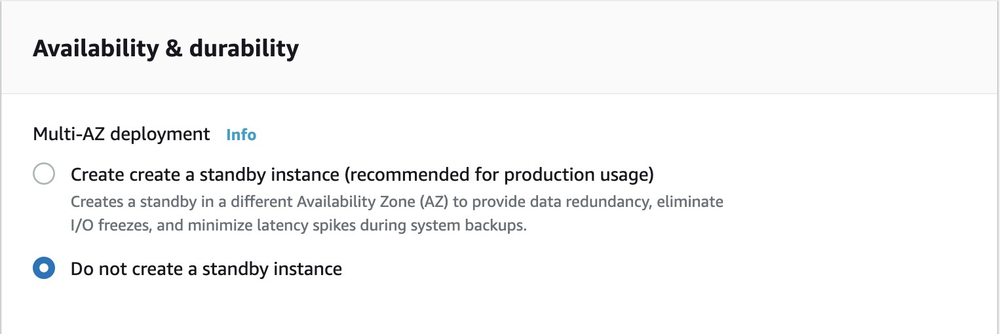
</p>
</div>

10. For the **Connectivity** section:
    * **Virtual Private Cloud (VPC)**: `Lab VPC`
    * Expand **Additional connectivity configuration**
        * **Subnet group**: `lab db subnet group`
        * **VPC security group**: ☑ **Choose existing**
        * **Existing VPC security groups**:
            * Uncheck `default`
            * ☑ `Lab DB Security Group`

<div>
<p align=center>
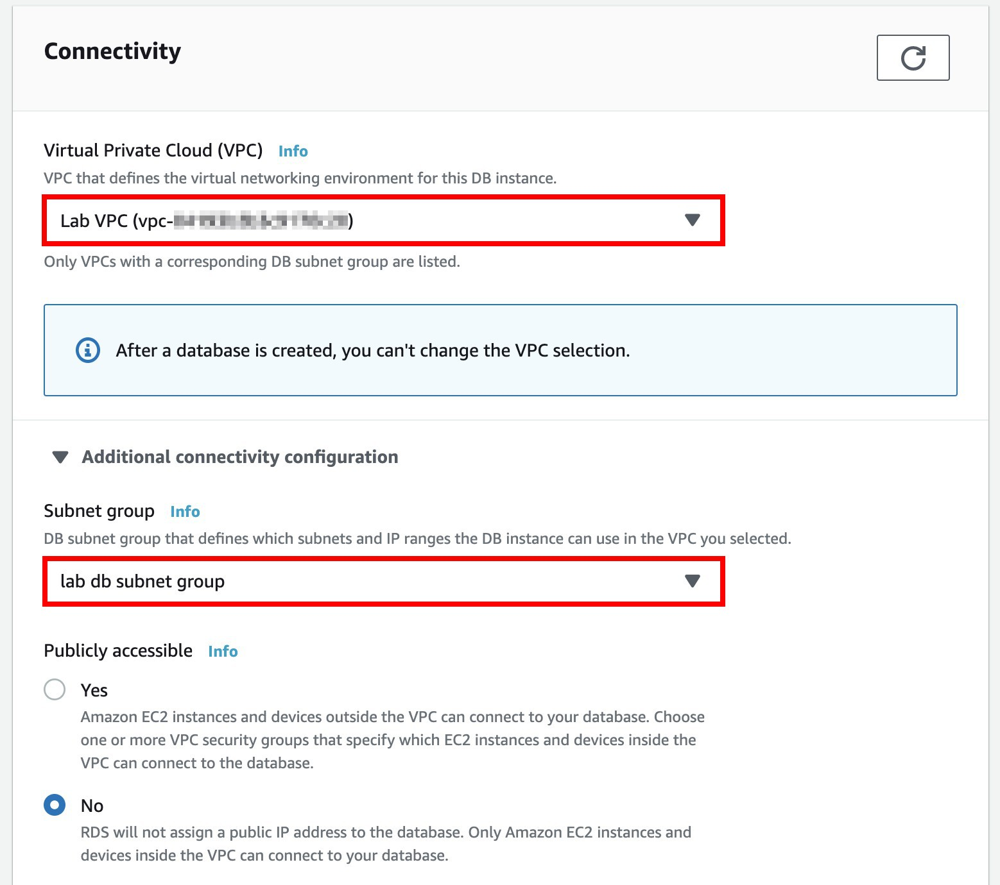
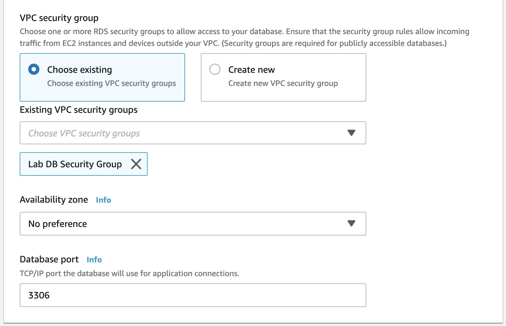
</p>
</div>

11. Expand **Additional configuration**:
    * **Initial database name**: `lab`

<div>
<p align=center>
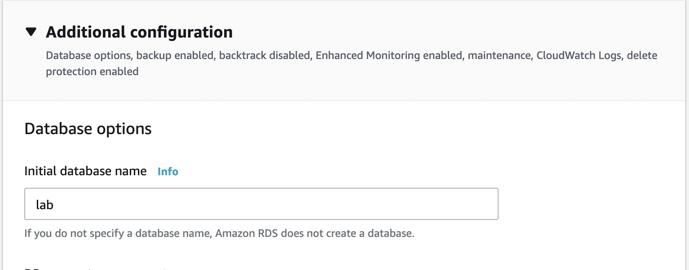
</p>
</div>

12. Scroll to the bottom of the page, uncheck the box of: **Deletion protection**.

13. Select **Create Database**, it will take ***10 - 15*** minutes to create your database, click **View DB instance details**, and keep refresh your webpage to check if it is done.

### Create an EC2 with a User Data

1. On the Service menu, select **EC2**.

2. On the left navigation pane, select **Instances**.

3. Select **Launch Instance**.

4. At the part of **Choose AMI**, select **Amazon Linux AMI**.

5. Select **t2.micro** for **Instance Type**, and select **Next: Configure Instance Details**.

6. At the **Configure Instance Details** part, fill in these configurations:
    * Network: `Lab VPC`
    * Subnet: `Lab Public Subnet 1`
    * Auto-assign Public IP: `Enable`

7. Scroll down to the buttom of the page, expand **Advanced Details**, and paste the script below into **User data**:

```bash
#!/bin/bash
# Install Apache Web Server and PHP 
yum install -y httpd24 php56 php56-mysqlnd mysql git
# Download web files
wget https://raw.githubusercontent.com/williamlin0504/php/master/index.php
wget https://raw.githubusercontent.com/williamlin0504/php/master/login.php
wget https://raw.githubusercontent.com/williamlin0504/php/master/style.css
mv index.php /var/www/html/
mv login.php /var/www/html/
mv style.css /var/www/html/
# Turn on web server 
chkconfig httpd on 
service httpd start
```

8. Select **Next: Add Storage** -> **Next: Add Tags** -> **Next: Configure Security Group**
> (Optional) You can add tags to specify the instance.

9. ☑ **Select an existing security group**, and select **WebSecurityGroup**.

10. Select **Review and Launch** -> **Launch**.

11. You can **Choose an existing key pair** or **Create a new key pair**, ☑ I acknowledge...., and select **Launch Instances**.

12. Because we have launch the instance with an ***user data***, it might take ***3 - 5*** minutes to launch, you can click **View Instances** to check the instance's status.

### Test with the CRUD webpage

1. Copy your instance's **Public DNS(IPv4)** and paste it to a new browser.

2. You will see a login page, fill in the configurations:
    * **RDS Endpoint**: `<Your-RDS-Endpoint>`
    * **Master Name**: `master`
    * **Password**: `lab-password`

<div>
<p align=center>
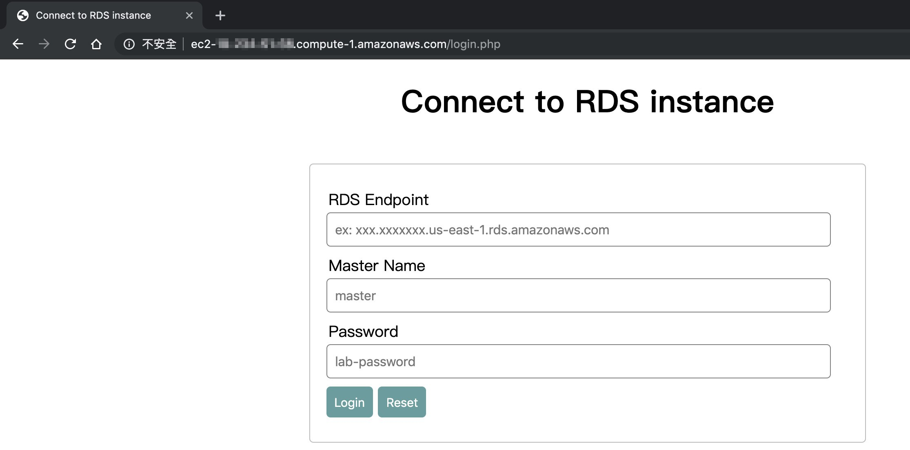
</p>
</div>

3. Select **Login**.

4. After login, you will see this page:

<div>
<p align=center>
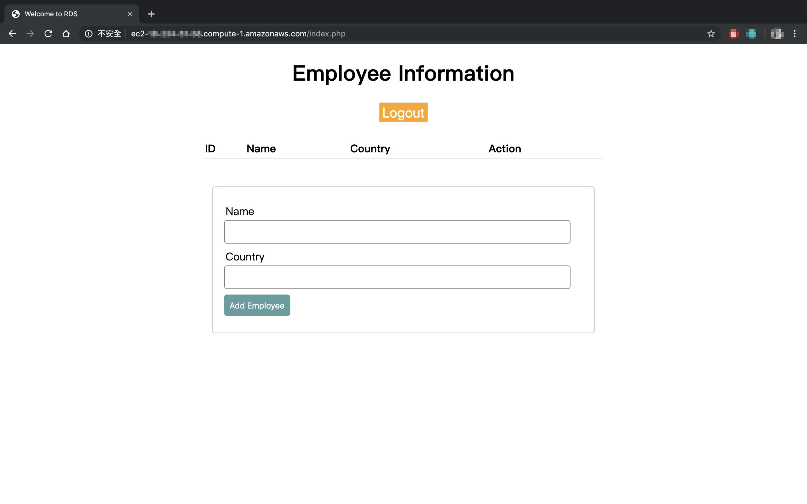
</p>
</div>

5. You can type **Name** and **Country** to add an employee information, after adding it will be like this:

<div>
<p align=center>
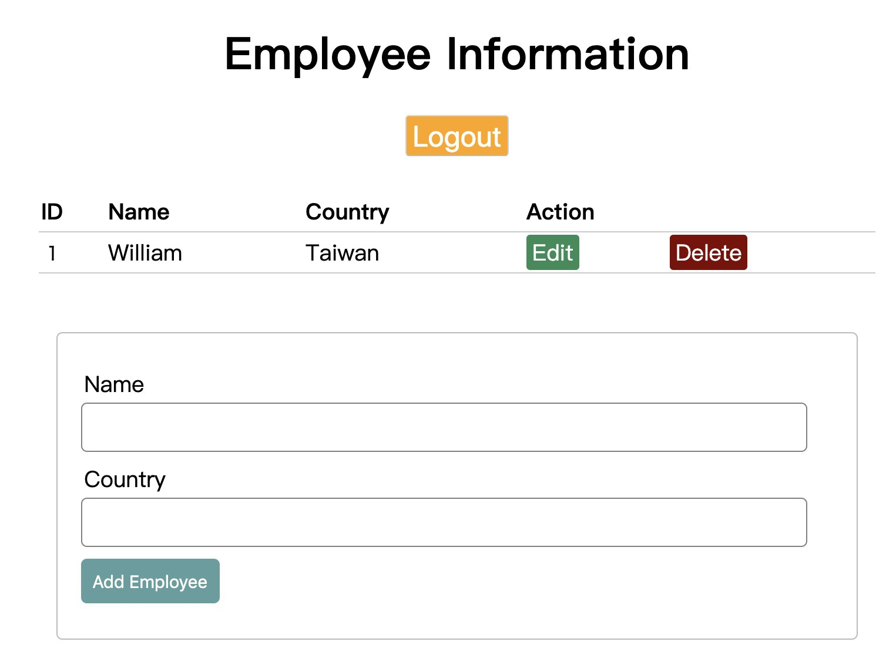
</p>
</div>

6. You can also click **Edit** or **Delete** to modify the data.

## Conclusion

After finishing this lab, you will learn how to prepare your VPC with CloudFormation. Also you can deploy a RDS database and Webserver in different available zone. The most is, you can connect your webserver to your databases, and test the website which can do CRUD to the data in your RDS database.

## Clean up

* **Cloudformation stack**
* **RDS database instance**
* **EC2 instance**