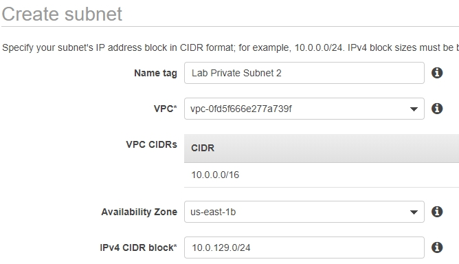
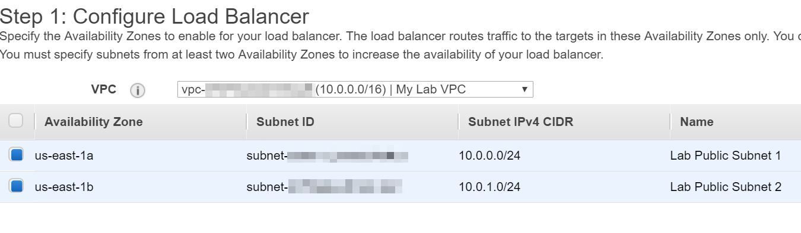
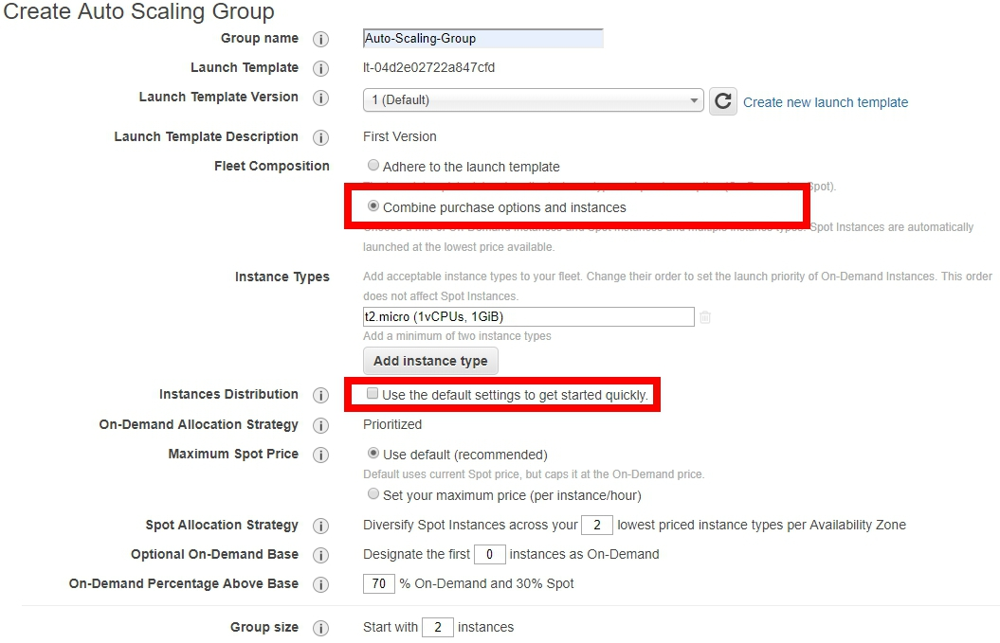
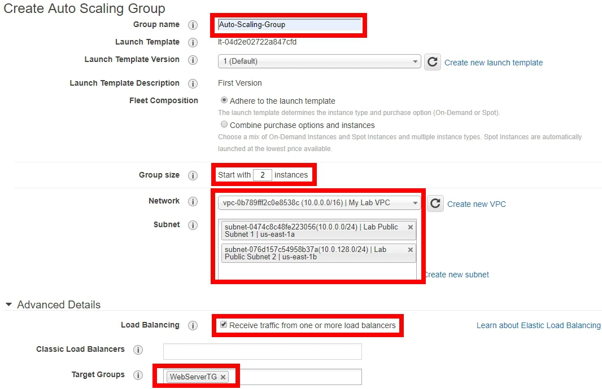
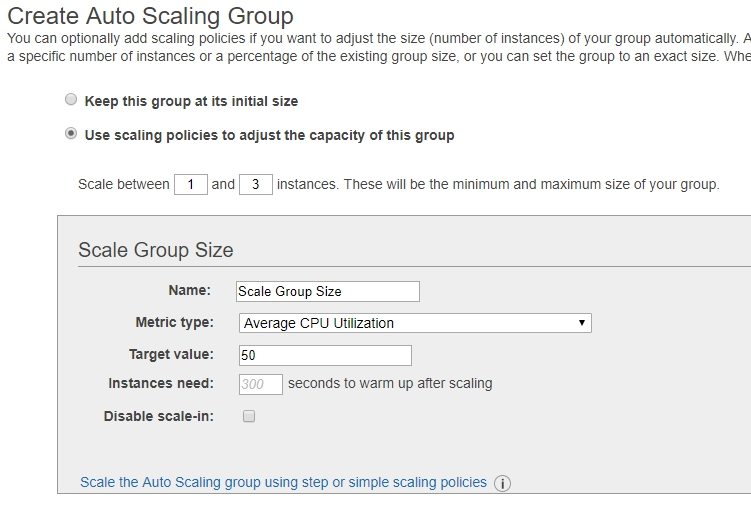

# Elastic your Architecture

## Overview
[Elastic Load Balancing](https://aws.amazon.com/elasticloadbalancing/) automatically distributes incoming application traffic across multiple targets, such as EC2 instances, containers, IP addresses, and Lambda functions. It also can handle the varying load of your application traffic in a single Availability Zone or across multiple Availability Zones.
This part will walk you to create an Application Load Balancer to distributes incoming application traffic to EC2. 

[Auto Scaling](https://aws.amazon.com/autoscaling/?nc1=h_ls) monitors your applications and automatically adjusts capacity to maintain steady, predictable performance at the lowest possible cost. Using AWS Auto Scaling, it’s easy to setup application scaling for multiple resources across multiple services in minutes. Scaling Policy can be customized in several ways.

When there's huge or unstable traffic, you can use load balancer to distributes incoming traffic, and setup Auto scaling to genarate enough instances to handle the traffic.

<p align="center">
    
</p>

## Senario
The following procedures help you set up a scaled and load-balanced application, you will start with CloudFormation, which automatically deploy half of your VPC environment and a web server. Then you will have to finish another half of VPC by your own. You will attach a load balancer to your Auto Scaling group. The load balancer automatically distributes incoming traffic across the instances in the group. This tutorial attaches a load balancer to an Auto Scaling group when you create the group, and set up a scaling policy to be triggered of target tracking scaling policy.

## Prerequisites
> The workshop’s region will be in ‘N.Virginia’

> Download [lab-network](lab-network.yaml/) to deploy

## Step by step 
### Deploy your VPC environment

[AWS CloudFormation](https://aws.amazon.com/cloudformation/) provides a common language for you to describe and provision all the infrastructure resources in your cloud environment. CloudFormation allows you to use a simple text file to model and provision, in an automated and secure manner, all the resources needed for your applications across all regions and accounts. This file serves as the single source of truth for your cloud environment. 
AWS CloudFormation is available at no additional charge, and you pay only for the AWS resources needed to run your applications.

1. On the **service** menu, select **CloudFormation**.

2. Select **Create stack**.

3. In **Prerequisite - Prepare template**, select **Template is ready**.

4. In **Specify template**, select **Upload a template file** and click **choose file**.

5. Find **lab-network.yaml**, which downloaded in prerequisites part and upload it.

6. Select **Next** to go on.

<p align="center">
    
</p>

7. In **Stack name**, input `YourName-Stack` and leave other settings as default, click **Next** button.

<p align="center">
    
</p>

8. Select **Next** to go on. We don't need to change any settings here.

9. Select **Create stack**.

You can see the CloudFormation template is creating resources, when it finish, you will see a public and private subnet and an EC2 instance create for you.

### Modify your VPC 
We have create half of the VPC environment in the previous part, now we're finishing another part. This part will include create NAT Gateway and associate your subnets to route table.

1. On the **Service** menu, select **VPC**.

2. In the navigation pane, select **Subnets**.

3. Select **Create subnet**.

4. Input the followings then select **Create** and **Close**:
    * Name tag: `Lab Public Subnet 2`
    * VPC: `My Lab VPC`
    * Availability Zone: `us-east-1b`
    * IPv4 CIDR block: `10.0.128.0/24`

<p align="center">
    
</p>

5. Select **Create subnet** again, this time we will create private subnet.

6. Input the followings then select **Create** and **Close**:
    * Name tag: `Lab Private Subnet 2`
    * VPC: `My Lab VPC`
    * Availability Zone: `us-east-1b`
    * IPv4 CIDR block: `10.0.129.0/24`

<p align="center">
    
</p>

7. In the navigation pane, select **Elastic IPs**.

8. Select **Allocate new address** and click **Allocate**.

9. In the navigation pane, select **NAT Gateways**.

10. Select **Create NAT Gateway**.

11. Select `Lab Public Subnet 2` and the Elastic IP you allocate before.

12. Select **Create a NAT Gateway**.

13. In the navigation pane, select **Route Tables**.

14. Select **Public Route** in the list and click **Subnet Association** tab in the bottom.

15. Click **Edit subnet association**, select `Lab Public Subnet 1` and `Lab Public Subnet 2`, then click the **Save** button.

16. Select **Private Route** in the list, this time, click **Routes** tab in the bottom.

17. Select **Edit routes**.

18. Click **Add route** and input the followings:

    * Destination: `0.0.0.0/0`
    * Target: `The NAT Gateway you create in previous step`

19. Click **Save routes**.

20. Back to Route table list, select **Private Route** again and click **Subnet Association** tab in the bottom.

21. Click **Edit subnet association**, select `Lab Private Subnet 1` and `Lab Private Subnet 2`, then click the **Save** button.

Now you have create two public and private subnet so far, they are now associate to their own route table, Internet Gateway and NAT Gateway.

### Create Load Balancer and Target Group

1. On the **service** menu, select **EC2**.
    
2. In the navigation pane, select **Load Balancers**.
    
3. Select **Create Load Balancer**.
    
4. Choose **Application Load Balancer**, and click **Create**.

5. Specify the following settings:

    * Name: `WebServerLB`
    * Scheme: choose **internet-facing**
    * VPC: select **My Lab VPC**, choose Subnet with **name** **Lab Private Subnet 1** and **Lab Private Subnet 2** 

<p align="center">
    
</p>

6. Select **Next: Configure Security Settings**.

7. Select **Next: Configure Security Groups**.

8. Select **Select an existing security group**, choose `ALB SG`.

<p align="center">
    
</p>

9. Select **Next: Configure Routing**.

10. Enter the following information, and leave other as default:

    * Name: `WebServerTG`

11. Select **Next: Register Targets**.
    > Because there's no EC2 yet, we'll register it later.

12. Select **Next:Review**.

13. Select **Create** and **Close**.

### Pack your AMI
 [Amazon Machine Image](https://docs.aws.amazon.com/AWSEC2/latest/UserGuide/AMIs.html) (AMI) provides the information required to launch an instance. You must specify an AMI when you launch an instance. You can launch multiple instances from a single AMI when you need multiple instances with the same configuration. You can use different AMIs to launch instances when you need instances with different configurations.

1. On the **Service** menu, select **EC2**.

2. In the navigation pane, select **Instances**.

3. Right click on the instance name **Web server**, select **Image** → **Create Image**.

4. Input the followings and select **Create Image**:

    * Image name: `My Lab AMI`
    * Image description:`AMI From Web Server`

<p align="center">
    
</p>

5. In the navigation pane, select **AMIs**. You can see your AMI's status, wait until it change to **available**.

### Create Launch Configuration or Launch Template 
In this part, select Launch Configuration or Launch Template to setup your auto scaling instances. Launch Configuration provide a simple way to create instance just like create a single EC2. Launch Template let you combine different types of EC2 instances, and customize the percentage of on-demand and spot instance.

Launch Configuration

Launch Template

### Create Launch Configuration

1. In the navigation pane, select **Launch Configurations**.

2. Select **Create launch configuration**.

3. In **Choose AMI**, find **Amazon Linux AMI** then click the **select** button on the right.

4. In **Choose Instance Type**, select **t2.micro** and click on **Next: Configure details**.

5. In **Configure details**, enter Name: `Auto-Scaling-Launch`.

6. Specify the following settings:
    * Purchasing option: select **Request Spot Instance**
    * Maximum price: **0.05**
    * User data: copy the following 
```
#!/bin/bash
# Install Apache Web Server and PHP 
yum install -y php72 wget httpd24
# Download Lab files 
wget https://raw.githubusercontent.com/ecloudvalley/How-to-build-an-elastic-structure/master/index.php
mv index.php /var/www/html/
# Turn on web server 
chkconfig httpd on 
service httpd start
```

> Because Spot Instance is cheaper than On-Demand instance, so we choose Spot Instance for Auto Scaling instances.

7. Click **Next: Add Storage**

8. Click **Next: Configure Security Group**

9. Select **Select an existing security group** , choose `Web SG`.

10. Click **Review**.

11. Review the details of your launch configuration and click **Create launch configuration**.

12. Click **Proceed without a keypair**, select the acknowledgment box, and click **Create launch configuration**.

13. Select **Create an Auto Scaling group using this launch configuration**.

### Create Launch Template

1. On the left navigaiton pane, select **Launch Template**, and select **Create Launch Template**.

2.  * Choose **Create a new template**
    * **Launch template name**: `Auto-Scaling-Launch`
    * **Template version description**: `First Version`

3.  * **AMI ID** choose **Amazon Linux AMI**.
    * **Instance type**: `t2.micro`
    * (Optional) **Key pair name**: Select a Key pair of your own or create one.
    * **Network type**: `VPC`
    * **Security Groups**: `Web SG`

4. In Instance tags, type:
    * **Key**: `Name`
    * **Value**: `Your name`

5. Expand the **Advanced details**, check **Request Spot Instances**, and select **Customize Spot parameters**.

6. Select **Set your maximum price(per instance/hour)**, type $ ```0.0045```, and select ```One-time``` for **Request type**.

7. Scroll down to the buttom of the page, copy and paste the command line below into the **User Data** which host a static web page:

```bash
#!/bin/bash
# Install Apache Web Server and PHP 
yum install -y php72 wget httpd24
# Download Lab files 
wget https://raw.githubusercontent.com/ecloudvalley/Auto-Scaling-With-Launch-Template/master/index.php
mv index.php /var/www/html/
# Turn on web server 
chkconfig httpd on 
service httpd start
```

8. Select **Create Launch Template**.

9. After the **Success** page showed up, select **Create Auto Scaling group** in the middle of the page.

### Create Auto Scaling group

1. On the Create Auto Scaling Group, enter the following detail:

    * Group name: `Auto-Scaling-Group`
    * Group size: Start with `1` instance
    * Network: select **My Lab VPC**
    * Subnet: select both **Lab Private Subnet 1** and **Lab Private Subnet 2**

2. (**Option**) Launch Template allow you to combine different types of EC2 when you create an auto scaling group. You can select **Combine purchase options and instances** and discheck **Use the default settings to get started quickly** to deploy the instances you want.

<p align="center">
    
</p>

3. Scroll down and expand **Advanced Details**, and select **Receive traffic from one or more load balancers**.

4. Click in the **Target Groups** textbox and then click **WebServerTG**.

<p align="center">
    
</p>

5. Click **Next: Configure scaling policies**.

6. Click **Use scaling policies to adjust the capacity of this group**.

7. Modify the **Scale between** textbox to scale between **1** and **3** instances.

8. Specify the following settings:
    * Name: **Scale Group Size**
    * Metric type: **Average CPU Utilization**
    * Target value: **50**

<p align="center">
    
</p>

9. Click **Next: Configure Notifications**.

10. Click **Next: Configure Tags**, enter the following details:

    * Key: **Name**
    * Value: **AutoScaling Instance**

11. Click **Review**.

12. Review the details of your Auto Scaling group, then click **Create Auto Scaling group**.

13. Click **Close** when your Auto Scaling has been created.

### Test your website 

In the ALB Website, the web page will be changed since refresh the browser. There's no cache in ALB.
1. In the navigation pane, click **Load Balancer**.

2. Check the **Description** tag bellow, copy **DNS name** and paste it to the browser.

Now you can see the **Port**, **Public IP**,**Instance ID** and **Time** shown on the page.

3. Press **Refresh** to see the difference between the website.

## Clean up
Make sure to clean up the service we just created.

* Launch Configuration

    1. In the navigation pane, choose **Launch Configurations**.

    2. Right click on **Auto Scaling Launch** and choose **Delete launch configuration**.

* Launch Template 

    1. In the navigation pane, choose **Launch Template**.

    2. Right click on **Auto Scaling Launch** and choose **Delete template**.

* Auto Scaling Group

    1. In the navigation pane, choose **Auto Scaling Groups**.

    2. Right click on **Auto-Scaling-Group** and choose **Delete**.

* Load Balancer and Target Group

    1. In the navigation pane, choose **Load Balancers**.

    2. Right click on **WebServerLB** and choose **Delete**.

    3. In the navigation pane, choose **Target Groups**.

    4. Right click on **WebServerTG** and choose **Delete**.

* CloudFormation Template

    1. On the **service** menu, select **CloudFormation**.

    2. Select the template you create in the previous step.

    3. Click the **Delete** button on the right.

## Conclusion
Congratulations! now you have learned:

* Setup your environment with CloudFormation template
* Create Subnet, NAT Gateway and associate to your route table
* Create Load Balancer and Target Group
* Create Launch Template
* Create Launch Configuration
* Create Auto Scaling Group
* Trigger Auto Scaling Group with Target Tracking Scaling Policy

## Appendix
To test the Website and Elastic Load Balancer, you can try [Bees-with-Machine-Guns](Bees-with-Machine-Guns/)
