# Deploy Your CloudFormation Template

## Overview
[AWS CloudFormation](https://aws.amazon.com/cloudformation/) provides a common language for you to describe and provision all the infrastructure resources in your cloud environment. CloudFormation allows you to use a simple text file to model and provision, in an automated and secure manner, all the resources needed for your applications across all regions and accounts. This file serves as the single source of truth for your cloud environment. 

    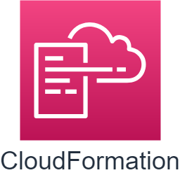

## Scenario
In this lab, we'll deploy a CloudFormation template first. This template includes a VPC with a single public subnet. Then, we'll deploy the next template to create an EC2 instance and a security group. After that, we'll try to upgrade the template and see what it has changed. At last, we'll clean up the template we've created in this lab and watch the deletion of the template.

## Prerequisites

> The workshop’s region will be in ‘N.Virginia’

> Download [CloudFormation-Network.yml](CloudFormation-Network.yml/), [CloudFormation-App.yml](CloudFormation-App.yml/) and [CloudFormation-App-v2.yml](CloudFormation-App-v2.yml/) before you start.

> If you are curious about the template file, prepare a text editor that can read **YAML** or **YML** like [Visual Studio Code](https://code.visualstudio.com/).

## Step by step

### Deploy CloudFormation-VPC

1. On the **Service** menu, select **CloudFormation**.

2. Select **Create stack** button.

3. In **Prerequisite - Prepare template**, select **Template is ready**.

4. In **Specify template**, select **Upload a template file** and click **choose file**.

5. Upload **CloudFormation-Network.yml**, which downloaded in the prerequisites section.

6. Select **Next** to go on.

    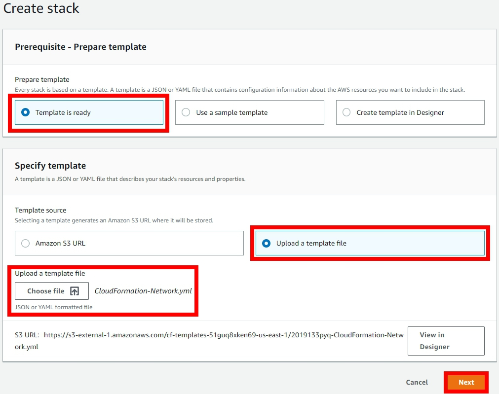

7. In **Stack name**, input `Lab-VPC-Stack` and leave other settings as default, click **Next** button.

    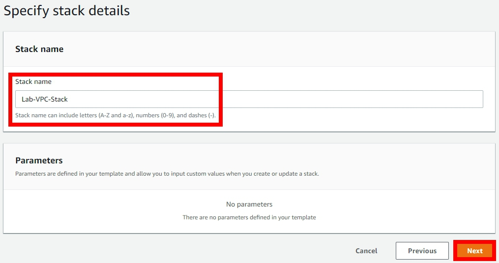

8. Select **Next** to go on. We don't need to change any settings here.

9. Select **Create stack**.

10. Select **Lab-VPC-Stack** in the list and click **Events** tab, wait until **Lab-Stack** shows **CREATE_COMPLETE** in status.

    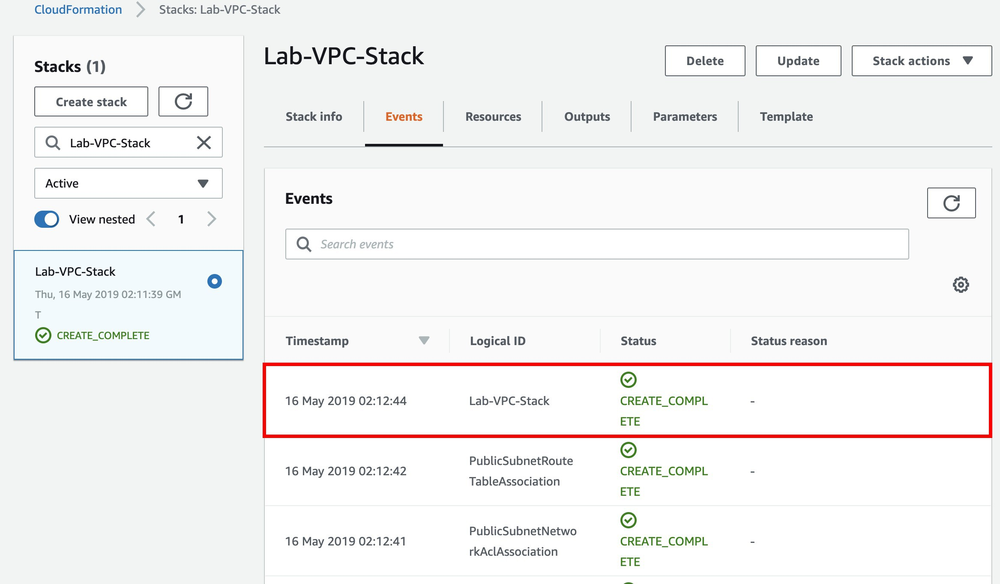

> The resources inside the template will be created in a few minutes.

11. Select the **Resources** tab and see what is inside.

    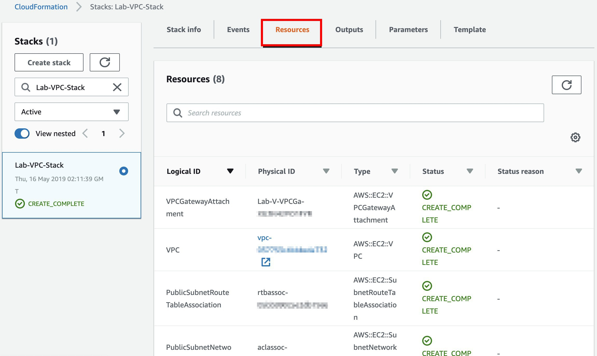

> You can see every resources that have been succesfully created.

12. Select the **Outputs** tab.

    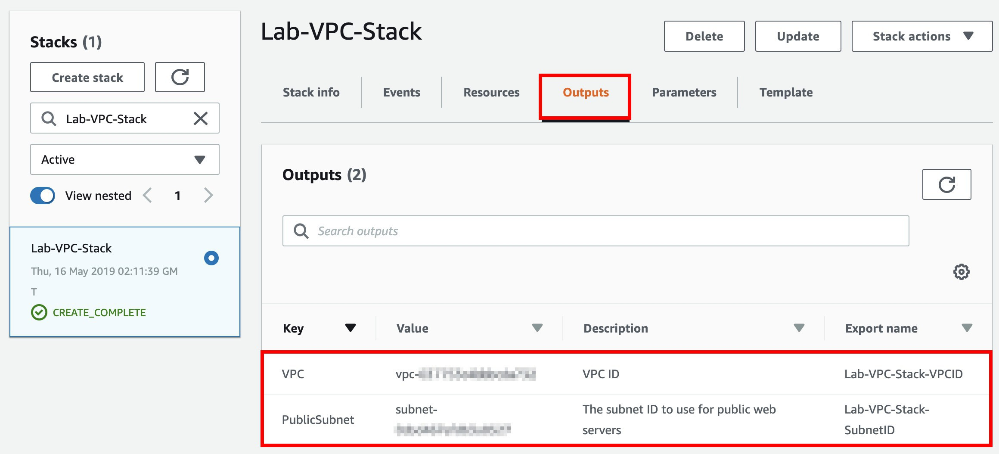

> We have outputs VPC and Public Subnet because we'll use it in next template.

### Deploy CloudFormation-App using VPC in another stack
Now we have our VPC environment setup, let‘s deploy an EC2 instance in this VPC.

1. Select **Create stack** button.

2. In **Prerequisite - Prepare template**, select **Template is ready**.

3. In **Specify template**, select **Upload a template file** and click **Choose file**.

4. Upload **CloudFormation-App.yml** which downloaded in the prerequisites section.

5. Select **Next** to go on.

6. In **Stack name**, input `Lab-App-Stack` and leave other settings as default, click **Next** button.

> Notice, if you have changed your stack name, please change **NetworkStackName** in the red box.

    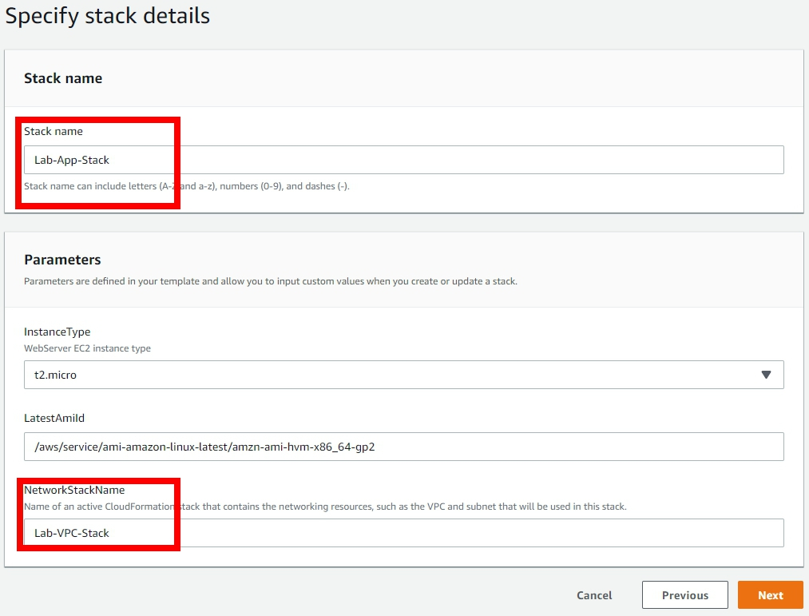

7. Select **Next** to go on. We don't need to change any settings here.

8. Select **Create stack** and back to your stack list.

9. Wait until the template to be created, Select **Outputs** tab.

10. Click the **URL** under **Value** tab, you'll see a webpage hosted in the EC2. It shows the details of your EC2.

    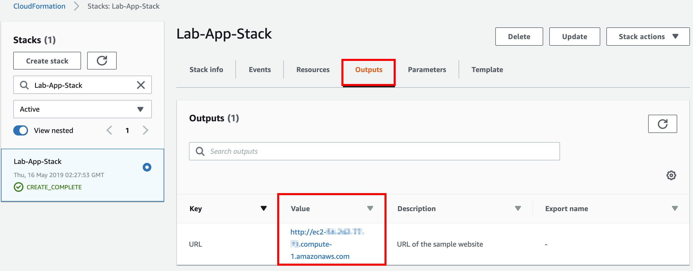

-------------------

    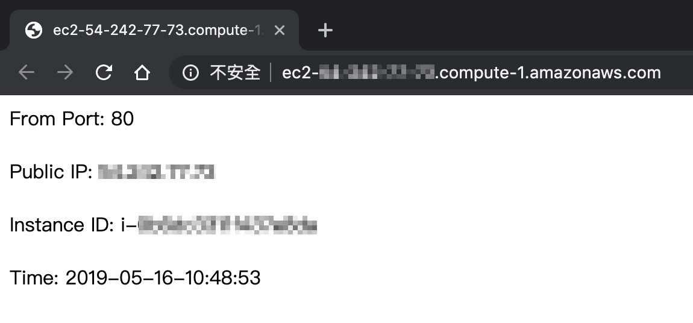

### Update your template
Since we already have a VPC and an EC2 instance, now we're going to make a little update. In this part, we'll update `Lab-App-Stack` we created in the previous step: ***Add a rule to security group and associate an elastic IP to EC2***.

1. Select the **Update** button on top of the page.

    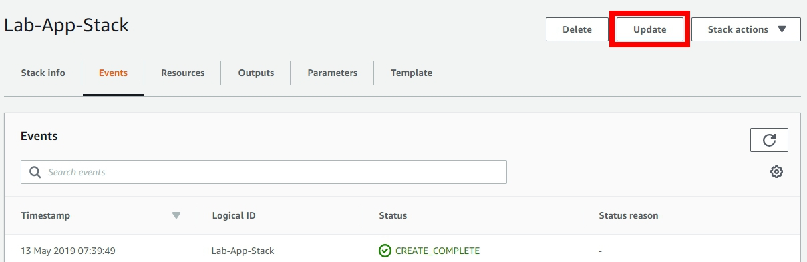

2. In **Prerequisite - Prepare template**, select **Replace current template**.

3. In **Specify template**, select **Upload a template file** and click **Choose file**.

4. Upload **CloudFormation-App-v2.yml**, which downloaded in the prerequisites section.

5. Select **Next** to go on.

    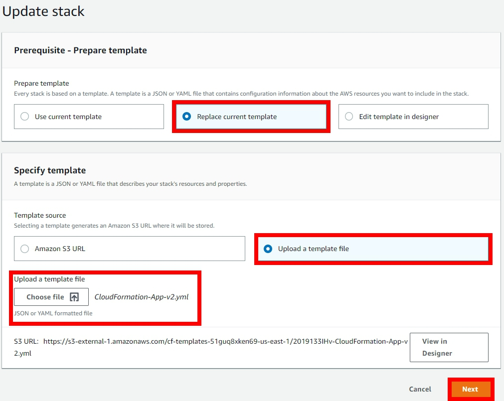

6. Select **Next** until the Review page.

7. Scroll down to the bottom of review page, you can see what have been updated in the **Changes** section.

    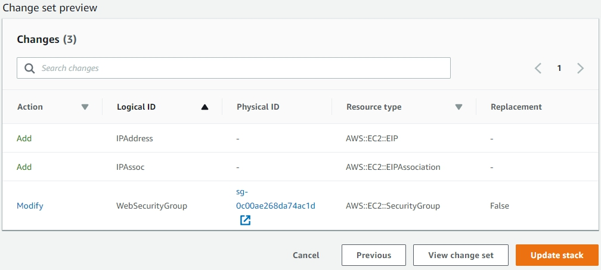

8. Select **Update stack**.

9. Select **Events** tab and you can see the status of the template.

    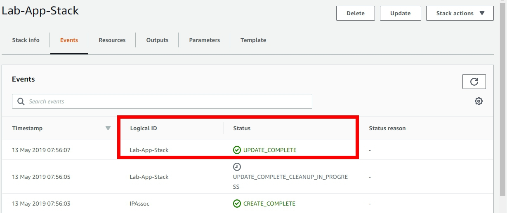

> Wait until update complete and you will get an EC2 with Elastic IP.

## Clean up

CloudFormation is easy to deploy and easy to clean up, just select your stack and click **Delete** button on the top. Please delete `Lab-App-Stack` first then delete `Lab-VPC-Stack` because `Lab-App-Stack` is based on the Internet environment created by `Lab-VPC-Stack`. During delete, you can check the **Events** tab and watch the deleting schedule.

## Conclusion

Congratulation! Now you have learned how to:
* Create a CloudFormation.yaml template.
* Deploy your infrastructure using CloudFormation.
* Monitor your template's status.
* Update your template.
* Delete your template.