Configure Virtual Assistant with Sumerian
=========================================

Unmanned stores using advanced technologies to enable human-free check out. When customers enter the store, how do they provide the most personalized service?

The Face Recognition Assistant can provide customized responses and recommendations, provide different product information and services for each customer, and collect customer data for analysis.
With the information collected, marketing strategies and personalized recommendations can be planned, which not only reduces labor costs, but also provides better services to customers.

[Amazon Sumerian]('https://aws.amazon.com/sumerian/?nc1=h_ls') let you create and run virtual reality (VR), augmented reality (AR), and 3D applications quickly and easily without requiring any specialized programming or 3D graphics expertise.

## Scenario

In this lab, we will use the previously established serverless website. First, we will use the AWS IoT MQTT client to publish the Topic and put the identification results on the topic. Then create a face recognition assistant who will subscribe to the Topic and use the recognition results to greet the user.

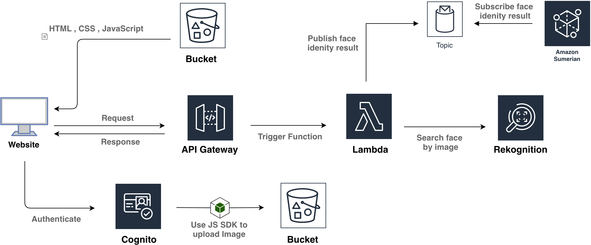

## Prerequisites
  -  Make sure you are in __US East (N. Virginia)__, which short name is __us-east-1__.
  - Complete Lab : 
    - [Create-Customize-Face-Collection-with-Rekognition](../03-Integrating-Amazon-Rekognition-into-Applications/301-Create-Customize-Face-Collection-with-Rekognition.md)
    - [Build-a-Serverless-Facial-Detect-Application-with-AWS-Lambda](../03-Integrating-Amazon-Rekognition-into-Applications/302-Build-a-Serverless-Facial-Detect-Application-with-AWS-Lambda.md)
	- [Publish-Identification-result-using-MQTT](401-Publish-Identification-result-using-MQTT.md)

## Create a Amazon Sumerian
- On the __Service__ menu, click __Amazon Sumerian__.

- Click __Create new scene__ to add new Sumerian.
<center>
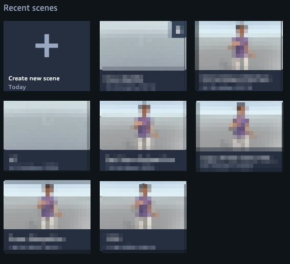
</center>

- Enter the name `Face-identify` in the field and click __Create__.
<center>
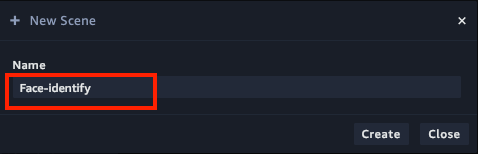
</center>

- Click Face-identify and will show left panel like this, choose __AWS Configuration__.

- Paste your Identity Pool ID that created by previous lab([Build-a-Serverless-Facial-Detect-Application-with-AWS-Lambda](../Build-a-Serverless-Facial-Detect-Application-with-AWS-Lambda/)).

- Enable __IoT Data client__.
<center>
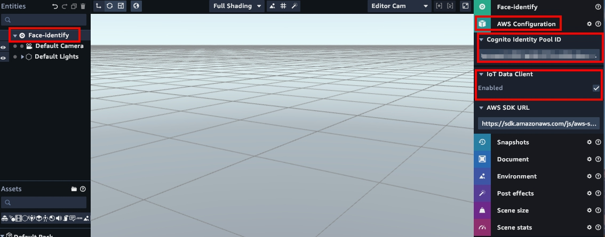
</center>

- Choose __Import assets__ at the top of the screen, and select __Cristine__.
<center>
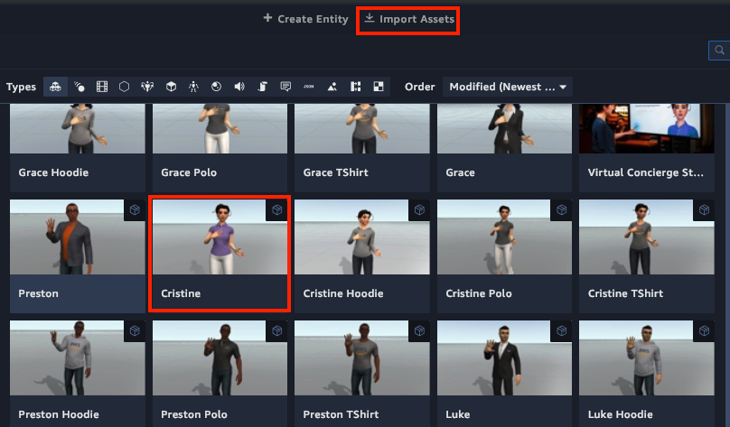
</center>

- After the editor finishes importing the asset pack, drag an entity that it contains from the assets panel onto the canvas to add it to your scene, and you will see the Cristine in scene.
> Note: You may need to zoom in to see Cristine
<center>
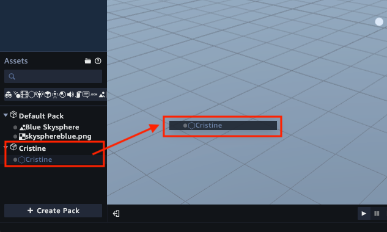
</center>
<center>

</center>

- Click __Cristine__ and choose __State Machine__, click __plus__ to add Behavior.
<center>
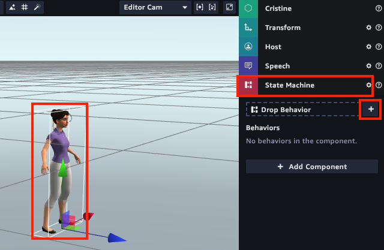
</center>

- In the state graph, use the default State 1 and rename it `Listen`. Then choose __Add Action__.
<center>
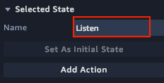
</center>

- In the __Add Action__ menu, search for and then add the __Listen__ action.
<center>
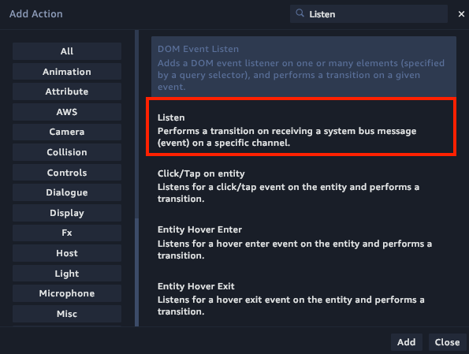
</center>

- Type `messageArrived` in __Message channel__ field.
<center>
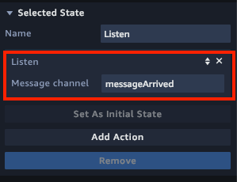
</center>

## Setup the connect from MQTT to Sumerian
- Add a new component and select the __Script__ component.
<center>

</center>
<center>
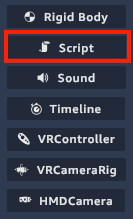
</center>

- Add a script by clicking the __+__ button and choose __Custom__ script.

<center>
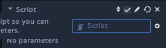
</center>

- Select the script you just add, and type `InitMQTT` as script name.
<center>
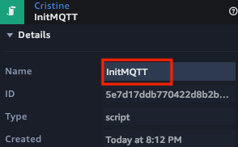
</center>

- Click __Edit Text Editor__, add the following url to __External Resources__, and click + to add.
```
https://cdnjs.cloudflare.com/ajax/libs/paho-mqtt/1.0.1/mqttws31.js
```
<center>
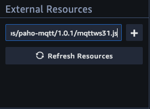
</center>

- Add the `getSignedUrl()` and `getSignatureKey()` function to script editor for authenticate Sumerian with __AWS IoT__.
```
function getSignedUrl(protocol, host, uri, service, region, credentials) {
	var datetime = AWS.util.date.iso8601(new Date()).replace(/[:\-]|\.\d{3}/g, '');
	var date = datetime.substr(0, 8);

	var method = 'GET';
	var protocol = 'wss';
	var uri = '/mqtt';
	var service = 'iotdevicegateway';
	var algorithm = 'AWS4-HMAC-SHA256';

	var credentialScope = date + '/' + region + '/' + service + '/' + 'aws4_request';
	var canonicalQuerystring = 'X-Amz-Algorithm=' + algorithm;
	canonicalQuerystring += '&X-Amz-Credential=' + encodeURIComponent(credentials.accessKeyId + '/' + credentialScope);
	canonicalQuerystring += '&X-Amz-Date=' + datetime;
	canonicalQuerystring += '&X-Amz-SignedHeaders=host';

	var canonicalHeaders = 'host:' + host + '\n';
	var payloadHash = AWS.util.crypto.sha256('', 'hex')
	var canonicalRequest = method + '\n' + uri + '\n' + canonicalQuerystring + '\n' + canonicalHeaders + '\nhost\n' + payloadHash;

	var stringToSign = algorithm + '\n' + datetime + '\n' + credentialScope + '\n' + AWS.util.crypto.sha256(canonicalRequest, 'hex');
	var signingKey = getSignatureKey(credentials.secretAccessKey, date, region, service);
	var signature = AWS.util.crypto.hmac(signingKey, stringToSign, 'hex');


	canonicalQuerystring += '&X-Amz-Signature=' + signature;
	if (credentials.sessionToken) {
		canonicalQuerystring += '&X-Amz-Security-Token=' + encodeURIComponent(credentials.sessionToken);
	}

	var requestUrl = protocol + '://' + host + uri + '?' + canonicalQuerystring;
	return requestUrl;
};

function getSignatureKey(key, date, region, service) {
	var kDate = AWS.util.crypto.hmac('AWS4' + key, date, 'buffer');
	var kRegion = AWS.util.crypto.hmac(kDate, region, 'buffer');
	var kService = AWS.util.crypto.hmac(kRegion, service, 'buffer');
	var kCredentials = AWS.util.crypto.hmac(kService, 'aws4_request', 'buffer');
	return kCredentials;
};
```

- Add the `MQTTConnect` function code to script editor for open the WebSocket, we will create a __Paho MQTT client__ and call __CONNECT__ to __AWS IoT__.
```
function MQTTConnect(ctx, requestUrl) {
	var clientId = String(Math.random()).replace('.', '') + "test";
	var client = new Paho.MQTT.Client(requestUrl, clientId);
	var connectOptions = {
		onSuccess: function () {
			console.log('Connected to IoT!');
			client.subscribe('Topic/FaceIdentify');
		},
		useSSL: true,
		timeout: 3,
		mqttVersion: 4,
		onFailure: function () {
			console.error('Failed to connect to IoT :(');
			setTimeout(MQTTConnect(ctx, requestUrl), 1000);
		}
	};
	client.connect(connectOptions);
	return client;
}
```

- Replace `setup()` function by following code, and type your iot endpoint in `<your iot endpoint>`.

```
function setup(args, ctx) {
	var aws = ctx.world.getSystem("AwsSystem");
	var credentials = aws.sdkConfig.credentials;

	var requestUrl = getSignedUrl('wss', '<your iot endpoint>', '/mqtt', 'iotdevicegateway', 'us-east-1', credentials);
	//connect with the credentials we got from above
	var client = MQTTConnect(ctx, requestUrl);

	//callback if our connection is lost
	client.onConnectionLost = function (responseObject) {
		if (cleanup) {
			return;
		}
		console.log("iot connection lost: " + responseObject.errorMessage);
		setTimeout(MQTTConnect(ctx, requestUrl), 1000);
	};
	
	//callback everytime a message arrives on our subscribed topic
	client.onMessageArrived = function (message) {
		try {
			if (message && message.destinationName && message.payloadString) {
				console.log("MessageArrived :", message);

				//set the payload so we can get it somewhere else in the scene
				ctx.worldData.payload = JSON.parse(message.payloadString);
				ctx.worldData.message = ctx.worldData.payload.state.reported.message;

				console.log("Payloading :", ctx.worldData.payload);
				console.log("Message :", ctx.worldData.message);

				//trigger all sumerian components listening to the messageArrived topic
				sumerian.SystemBus.emit('messageArrived');
			}
		} catch (e) {
			console.log("error! onMessageArrived " + e);
		}
	};
	ctx.worldData.mqttClient = client; //set the client for the entire application to use
}
```

- Click __Save__.

## Configure Sumerian Speech
- Click __Cristine__ and choose __Speech__ .

- Add a speech file by clicking the __+__ button.

- Open the Text Editor by clicking edit.
<center>
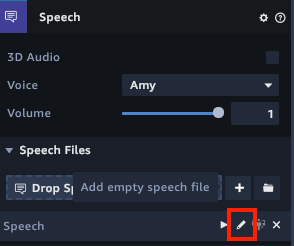
</center>

- Enter the following code to setup speech.
```
<speak></speak>
```

- Click __Cristine__ and choose __State Machine__ to edit __Behavior__.

- Add a new state in Behavior.
<center>
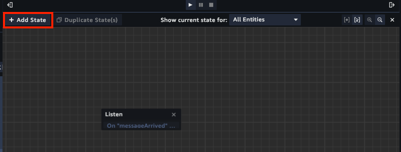
</center>

- Type `Speaking` as state name.
<center>
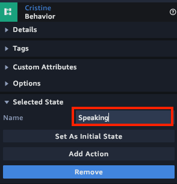
</center>

- Select the state you create, click __Add Action__ and choose __Exec Script__.
<center>
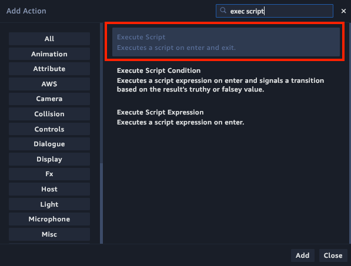
</center>

- Add a script by clicking the __+__ button and choose __Custom__ script.
<center>
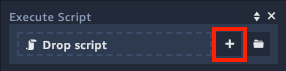
</center>

- Select the script you just add, and type `SpeakSetting` as script name.
<center>
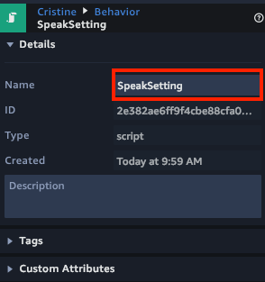
</center>

- Click __Edit Text Editor__.

- Add `compileSpeech()` function and replace `enter()` in Text Editor, here we reset Sumerian's voice use `Zhiyu`, who support to speak chinese with [Polly]('https://docs.aws.amazon.com/polly/latest/dg/voicelist.html') Services.
```
function compileSpeech(speech, args) {
	return speech.replace(/\$\{([^}]+)\}/g, (match, variable) => args[variable] || '');
}
// When used in a ScriptAction, called when a state is entered.
function enter(args, ctx) {
	try {
		const speechComponent = ctx.entity.getComponent('SpeechComponent');
		const speech1 = ctx.entity.speechComponent.speeches[0];

		// add speech to speechComponent
		speechComponent.addSpeech(speech1);

		// setup polly voice
		ctx.entityData.Speech = speech1;
		speech1.updateConfig({
			body: '<speak>' + ctx.worldData.message + '</speak>',
			voice: 'Zhiyu'
		});

		// play the speech
		speech1.play();

		return ctx.transitions.success();

	} catch (error) {
		console.error('Error creating speech', error);
		return ctx.transitions.failure();
	}
}
```

- Back to __State Macnine__ and select Behavior, add transitions between both states by clicking on an action and dragging an arrow to the other state.
<center>
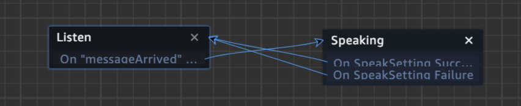
</center>

## Deploy Sumerian
- Click __Publish__ on top right navgation, and choose create a public link.
<center>
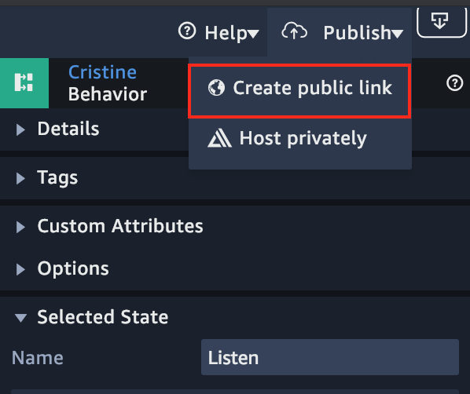
</center>

- It will show warning to agree publish sumerian to public, click __Publish__.
<center>
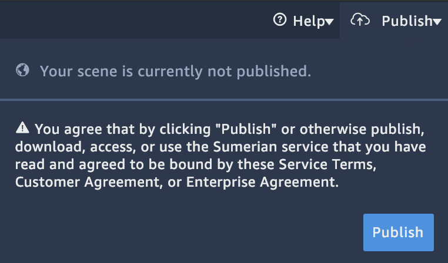
</center>

- Copy the url and paste it to web.
<center>
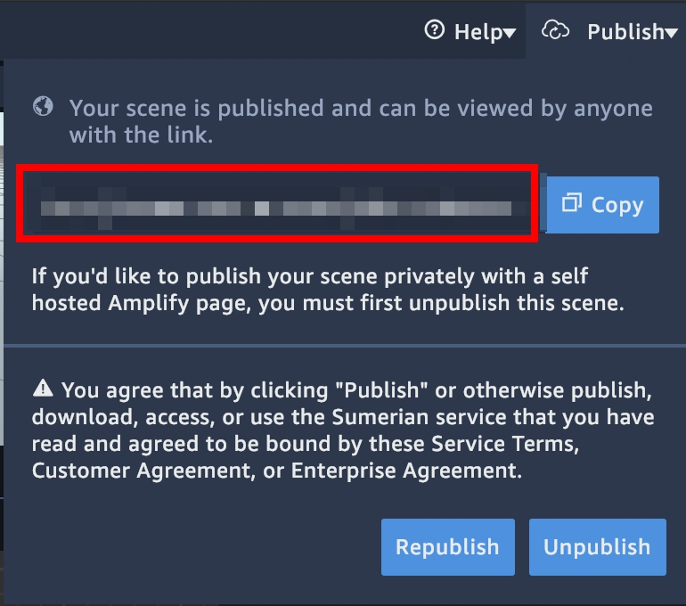
</center>

- Open the web and reupload the [__test.jpeg__]('../Build-a-Serverless-Facial-Detect-Application-with-AWS-Lambda/test.jpeg'), the Sumerian host will greeting with you.
<center>

</center>

## Conclusion
Congratulations! We now have learned how to:
- Build Face Recognition Assistant with Amazon Sumerian
- Use Amazon IoT to publish / subscribe topic
- Publish your Sumerian Host

## Clean up
- The API you created
- S3 bucket to store image
- S3 bucket to host static website
- The Lambda function you create to identify face
- The Lambda function you create to build customize face collection
- Cognito identity pool
- Face Recognition Sumerian Host


